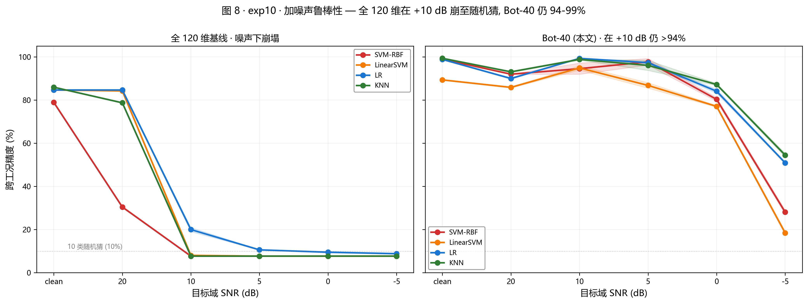
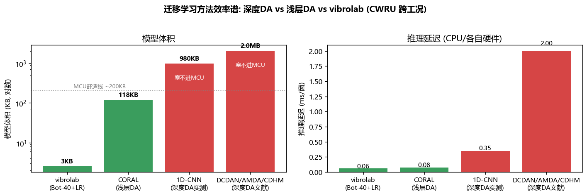
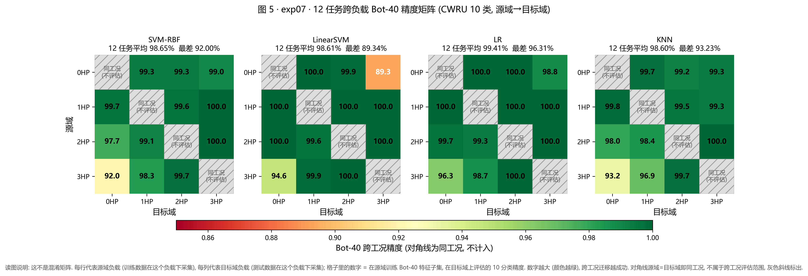
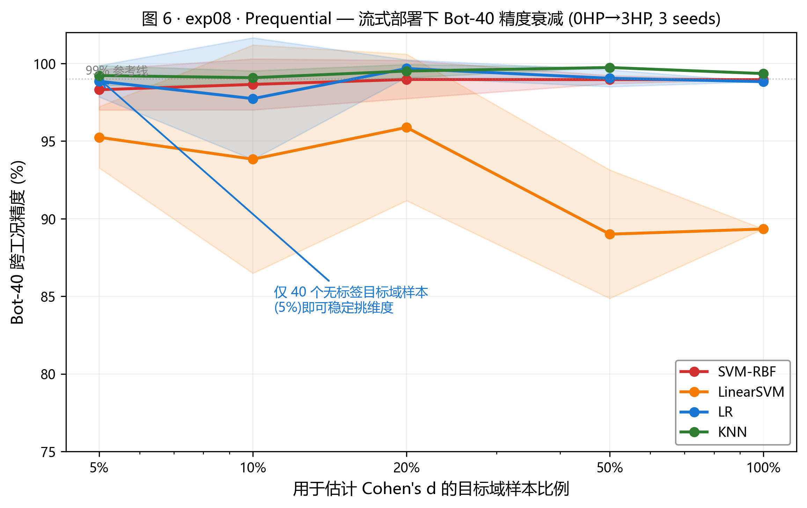
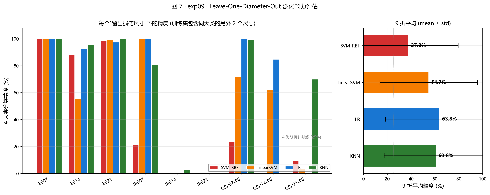

# vibrolab

> **把跨工况故障诊断塞进 ESP32-S3, 整机 BOM ~40 元, 单窗推理 0.6 ms.**
> CWRU 10 类 · 双工况训练 → 全 4 工况泛化 100% · 2 KB 模型跑在 40 元级开发板 (ESP32-S3-DevKitC-1 ~24 元 + OLED ~10 元 + 线材)

https://github.com/kanglongh/vibrolab/raw/main/firmware_v1_5/assets/video1_iepe_baseline.mp4

<video src="https://github.com/kanglongh/vibrolab/raw/main/firmware_v1_5/assets/video1_iepe_baseline.mp4" controls width="100%"></video>

*板子实时诊断: OLED 顶端波形, 中间中文标签 (正常/内圈007/外圈007…), 底部置信度条 + 延迟数值. 完整故事 + 4 段传感器降级对照视频见 [`firmware_v1_5/README.md`](firmware_v1_5/README.md).*

---

## 30 秒定位

- **实物部署**: **2 KB** 模型烧进 ESP32-S3, 单窗推理 **0.6 ms**, 整机 BOM ~40 元 (开发板 + OLED + 线). 见 [firmware_v1_5](firmware_v1_5/README.md).
- **跨工况精度**: 0+3HP 双工况训练 → **held-out 1/2HP 也 100%**. CWRU 12 任务矩阵均值 **98.6%–99.4%**, 最差单点 89%.
- **传感器边界** (软件降级模拟, exp17): IEPE (万元级) 100% · ADXL1002 (工业 MEMS) **99.80%** · ADXL355 38.98% · MPU6050 10.17%. 结论: **带宽是硬约束, 便宜工业 MEMS 撑得住**.
- **算法效率**: **3 KB** 模型 vs 深度 DA (DCDAN/AMDA 类) **1–2 MB 要 GPU 塞不进 MCU**; 浅层 CORAL 118 KB 但跨工况精度 49.21%. vibrolab 是同精度下最小、能进 MCU 的方案. 详见 [效率对照](#效率对照--vs-主流迁移学习方法-exp15).
- **诚实的边界**: exp09 阴性结果 (未见损伤尺寸外推崩塌) 主动列出; ADXL1002 99.80% 是软件模拟, 真机预期 90–95%. 见 [已知局限](#已知局限).
- **一键复现**: `python firmware_v1_5/train_export_model.py` (~10s 出 model.h) 或 `python experiments/99_run_all.py` (~2min 全实验).

---

## 一分钟看结果

**CWRU 10 类轴承数据集, 0 HP → 3 HP 跨负载测试** (严格无重叠切分, 训练/测试不共享 .mat 文件):

| | SVM-RBF | LinearSVM | LR | KNN |
|---|---:|---:|---:|---:|
| 同工况 5-fold CV | 100.00% | 100.00% | 100.00% | 100.00% |
| 同工况留一文件 3-fold (严格) | 99.77% | 99.93% | 99.70% | 99.70% |
| 全 120 维直接跨负载 (无对齐) | 78.93% | 84.66% | 84.66% | 85.96% |
| **Bot-40 低漂稳定子集** | **98.96%** | 89.34% | **98.83%** | **99.35%** |

*完整方法学讨论与 12 任务全负载矩阵见 [`outputs/VERIFICATION.md`](outputs/VERIFICATION.md).*

### 最有说服力的一张对比 · 加噪声鲁棒性



*全 120 维特征在信噪比 +10 dB 时直接崩到 7.7% (10 类均匀猜测下限), Bot-40 稳定子集在同一噪声档位保持 94 到 99%. 详见 [`exp10_noise_robustness.csv`](outputs/exp10_noise_robustness.csv).*

---

## 效率对照 · vs 主流迁移学习方法 (exp15)

跨工况轴承诊断的迁移学习方法, 按计算效率排:



| 迁移学习方法 | 模型体积 | 推理/窗 | 能否进 MCU | 3HP 精度 |
|---|---:|---:|:---:|---:|
| **vibrolab (Bot-40+LR)** | **3 KB** | 0.06 ms | 能 (ESP32) | 98.8% |
| CORAL (浅层 DA) | 118 KB | 0.07 ms | 能 | 49.21% |
| 1D-CNN / DCDAN / AMDA / CDHM (深度 DA) | 1–2 MB | 0.35–2 ms | 不能 | ~99% (要 GPU) |

深度 DA 精度高, 但 1–2 MB 塞不进 MCU, 要 GPU. CORAL 体积够小能进 MCU, 但跨工况 49.21% (文献 [AMDA]; 本地复测 ~41%, 同结论). vibrolab 3 KB, 能进 ESP32 级 MCU 且精度不掉.

数据: [`experiments/15b_tl_efficiency.py`](experiments/15b_tl_efficiency.py) (CORAL/vibrolab 实测), 1D-CNN 见 [`15a_efficiency_baseline.py`](experiments/15a_efficiency_baseline.py), 文献深度 DA 精度见 [`exp05_benchmark_table.csv`](outputs/exp05_benchmark_table.csv).

---

## 传感器需求 · 软件降级模拟 (exp17)

算法效率解决了, 整机成本另一半在**传感器**. CWRU 数据用的是工业级 IEPE 压电加速度计 (PCB 353B33 类, 万元级). 直接部署真机需外接一支——软件对 CWRU 信号做降级 (加噪声 / 限带宽 / 降 ADC 位深), 模拟不同档次 MEMS 传感器测同一模型:

| 传感器档 | 带宽 | 噪声底 | ADC | 成品单价 (RMB) | Held-out 精度 |
|---|---:|---:|---:|---:|---:|
| IEPE 基线 (PCB 353B33 类) | 6 kHz | 4 μg/√Hz | — | 3000-10000 | **100.00%** |
| **ADXL1002 成品** (工业 MEMS) | 11 kHz | 25 μg/√Hz | 12-bit @ ±50g | 500-800 | **99.80%** |
| ADXL355 成品 (低带宽高精度 MEMS) | 1.9 kHz | 25 μg/√Hz | 20-bit @ ±8g | 700-1000 | 38.98% |
| MPU6050 模块 (消费级 IMU) | 260 Hz | ~400 μg/√Hz | 16-bit @ ±16g | 50-200 | 10.17% |

成品单价含: 芯片 + 调理电路 + 外壳 + 连接器 (MPU6050 是现成模块无工业外壳).
量化采用**传感器固定量程 + ADC 固定位深**, 反映模拟输出→ADC 的自然物理链路 (信号仅占满量程约 10%, 有效量化 SNR 比"满量程 12-bit"低约 20 dB).

- **ADXL1002 级 MEMS 完全撑得住** —— 99.80% 与 IEPE 基线基本打平, 相比 IEPE 传感器**便宜一个数量级**, 是本项目的关键工程可行点.
- **ADXL355 反而崩了** —— 噪声底更低但**带宽只有 1.9 kHz**, 把 2–5 kHz 的轴承高频冲击信号滤掉了. **带宽比噪声底更关键**.
- **MPU6050 消费级 IMU 彻底不行** —— 默认 DLPF 配置下带宽仅 260 Hz, 精度掉到 10 类随机猜的水平 (10%).

**意味着整机 BOM (MCU ~24 + OLED ~10 + ADXL1002 成品 ~600 + 附件) 约 700-900 元档就能撑起 vibrolab 的算法**——对比工业 CMS 系统单点上万到十万, 成本差 1-2 个数量级.

⚠️ 这是软件降级模拟, 不代表真机接入的最终精度. 真机部署还有:
- **ADXL1002 模拟输出接 ESP32 ADC** 的运放前端设计 + ESP32 内置 ADC 有效位数 (ENOB ~8-9 bit, 低于名义 12-bit) + 采样时序抖动
- **传感器安装耦合** (磁座 vs 螺纹差 3-6 dB) 与温漂 (工业环境 -20 到 +80°C)
- **EMI 干扰** (变频器附近的强电磁环境)
- **跨机器 domain shift** (CWRU 台架 vs 你的机器可能特征分布本身就不一样)

综合下来预期精度会从模拟的 99.80% 掉到 **90-95% 范围** (同类机型) 或更低 (跨机型). 见 [`experiments/17_sensor_degradation.py`](experiments/17_sensor_degradation.py) 可复现模拟部分, 真机接入是后续工作.

---

## 关于本项目

我是燕山大学机械工程学院 2027 届硕士, 独立课题做**液压柱塞泵故障诊断**, 走**物理特征 + 传统 ML** 这一路——追求小样本、跨工况、可解释, 不追 SOTA.

做完柱塞泵的主线之后, 我一直好奇一个问题: **这套方法到底是我针对柱塞泵调出来的偶然, 还是它反映了旋转/流体机械故障诊断的某种通用范式?** 光在同一份数据上跑证明不了这个问题——那是**内部一致性**, 不是**外部有效性**. 所以我拿了轴承故障诊断领域的标准基准 (CWRU), 把整套流水线原封不动地搬过去, 看能不能拿到同一量级的精度.

**这个仓库就是这次迁移验证的完整记录**——数据、代码、CSV、图表、部署规格、LLM 接口示例全部公开可复现. 简历上如果只写一行"跨工况诊断 X%", 读者会怀疑这个数字是不是造出来的; 但把整套流程、每一个数字、每一个阴性结果 (见 [exp09](outputs/VERIFICATION.md)) 都放到 GitHub 上, 至少证明**我这套方法不是柱塞泵专属的偶然**.

---

## 作者的碎碎念 (可跳过)

上集说到, 我本职做柱塞泵故障诊断. 想到这套方法是否能外推到轴承, 于是做了一系列尝试, 最后核算计算成本, 结论是可以边缘部署到 MCU 上.

但只提想法看不到实物, 心里没底, 就吃不下饭睡不着觉. 就怕别人说:
> "吹牛逼嘞. 学界故障诊断都用神经网络深度学习, 甚至有人在准备用大模型做. 诊断通用模型马上就来, 以后是大模型的天下, 你拿着淘汰了 20 多年的信号处理就想打? 未免太过不自量力."

这个我无从辩驳. 但有几个点得说清楚:

**关于"深度学习吊打传统方法"这件事.** 神经网络确实好用, 只需要调参调包, 就能画一条不错的拟合曲线, 拿到很不错的精度 (100%). 但吊诡的事出在这里——我拿传统方法组合出一个新架构, 结果也能达到同数量级. 拿着这个结果我再回头看, 就看见了之前看不见的东西. 我愿称之为**数据集工程**: 当数据集本身就易分的时候, 用什么方法都无所谓. 就像小学期末考试, 小学生能拿满分, 大学生也能拿满分——你能因此说大学生很厉害吗? 题太简单, 谁都可以.

CWRU 数据集学界已经做透了. 因此我在这里做的只是**验证**, 真让我发刊说这个我不敢. 事实上我拿课题组的私有柱塞泵数据集 (3 组泵) 做尝试, 结果也很吊诡: 单工况分类精度随随便便就 100%. 我把它归因到**数据集可分性太强**——真正的瓶颈在跨域精度, 那才是深度学习真正发力的地方.

**所以这个开源实验报告, 是我针对跨域的尝试.**

别看着报告好像还行, **它其实是失败的**. 别问为什么不发刊, 问就是不想走学术界了. 我这个方法没什么创新, 就是把坟墓里的尸体抬出来, 化个妆来打——本来是想拿它做基线对比的, 结果被打崩了, 不得不感慨老祖宗还是老祖宗啊. (当然我这里的"失败"指的是在**我私人的数据集**上; CWRU 这套跑得很干净, 报告里的论证不受影响. 这段是碎碎念, 看看就好, 不严谨的地方在所难免.)

**另一个亮点: 大模型的文本解释.** 这里又有个小知识点—**大模型可以做分类器吗?** 其实可以 (我师兄证明了), 但严格意义下不够好, 至少在我的场景下没能体现出这个优势. 没错, 就是大模型被打崩了. 于是我痛定思痛, 发现是**我的应用场景错了**: 大模型不该做分类器. 它可以做**解释器**, 也可以做 **Agent** (对, 现在已经有人在做故障诊断 Agent 了). 给它的 skill 足够多, 它甚至可以泛用到任何一个领域的故障诊断 (有很多人在做, 我也在尝试). 所以以后的故障诊断范式, 逃不了这个命运.

**反过来想, 这就是时代的浪潮.** 我也就觉得学术界待不下去了——所有研究领域最后都会指向大模型, 我们能做的常态研究, 也只是给大模型加一个 skill.

因此我做了一个转向: **把故障诊断拉到工业界, 用极致的性价比, 去达到最好的结果**. 这就是本项目的核心理念.

---

## 快速开始

```bash
pip install -r requirements.txt
```

下载 CWRU 数据集到 `data/` 目录下 (`Normal` 和 `12k_DE` 两个子文件夹, 详见 [`data/README.md`](data/README.md)), 然后一键跑完所有实验:

```bash
python experiments/99_run_all.py
```

产物落在 [`outputs/`](outputs/) 文件夹下:
- 10 个实验的 CSV 数据表
- 9 张结果图 (`outputs/figures/`)
- 完整验证报告 [`VERIFICATION.md`](outputs/VERIFICATION.md)
- 部署规格卡 [`exp12_deploy_spec.txt`](outputs/exp12_deploy_spec.txt)
- LLM 诊断接口示例产物 [`exp06_diagnosis_report.md`](outputs/exp06_diagnosis_report.md) 和 [`exp06b_diagnosis_report_api.md`](outputs/exp06b_diagnosis_report_api.md)

---

## 全链路架构

```
原始振动信号 (.mat, 12 kHz)
    ↓
120 维物理可解释特征 (CFD)
    ├── 时域 12 维    (RMS / 峭度 / 波形因子 / ...)
    ├── 频域 15 维    (质心 / 带宽 / 谱斜率 / ...)
    ├── 分频带 64 维  (32 带能量比 + 32 带对数能量)
    ├── 主峰 12 维    (Top-6 主导频率与幅值)
    └── 倒谱 17 维    (调制模式捕捉)
    ↓
无监督特征预对齐 (Cohen's d 逐维分布漂移排序, 取最稳定 40 维 = Bot-40)
    ↓
sklearn 分类器 (SVM-RBF / LinearSVM / LR / KNN, 四路平行对照)
    ↓
结构化诊断结果 (故障类型 + 置信度 + 关键特征模块)
    ↓
[可选] LLM 后端 (本地小模型 / OpenAI-Compatible 云端 API 双通道)
    ↓
自然语言维修建议
```

---

## 扩展验证实验

完整讨论见 [`outputs/VERIFICATION.md`](outputs/VERIFICATION.md), 每一个数字都可追溯到对应 CSV.

### 12 任务全负载矩阵 (exp07)



4 路分类器在全部 12 个 (源, 目标) 组合上的 Bot-40 精度. 平均 98.6% 到 99.4%, 最差单点约 89%.

> **和 v1.5 硬件 demo 100% 精度不冲突**: 这里是**单工况训练 → 单工况测试**的严格评估 (最悲观协议, 提供下界); v1.5 硬件用**双工况 (0+3HP) 合训**给模型跨工况多样性, 泛化到 1HP/2HP 的插值场景, 因此精度更高. 两个数测的是不同的东西.

### 流式部署 Prequential 验证 (exp08)



预热样本比例扫: 5% / 10% / 20% / 50% / 100%. 结论: 5% 已足够, SVM-RBF/LR/KNN 三路的精度衰减在 <0.5 pp 内.

### 未见损伤尺寸外推 · 阴性结果 (exp09)



留一损伤尺寸交叉验证. 9 组均值精度 37.8% 到 63.8%, 内圈中大尺寸 (IR014, IR021) 直接崩到 0%. **这是 CWRU 数据集本身的结构性天花板**——每类只有 3 种损伤直径, 中间尺寸的连续外推无法完成. 主动列出这个阴性结果, 是为了让读者对本仓库其他实验里的 "99%" 有正确的心理锚点.

| 实验 | 核心结论 |
|---|---|
| [exp02](experiments/02_within_condition.py) | 同工况严格协议 (留一文件) 99.7%, 说明 CFD 表达力天花板高 |
| [exp03](experiments/03_cross_condition.py) | 0HP→3HP 全 120 维 78.93% → Bot-40 98.96%, +20 pp 提升 |
| [exp05](experiments/05_literature_benchmark.py) | 与 DCDAN / AMDA / CDHM 等深度 DA 方法同量级, 零训练 |
| [exp07](experiments/07_all_12_tasks.py) | 12 任务矩阵均值 98.6% 到 99.4%, 非 cherry-picking |
| [exp08](experiments/08_prequential.py) | 5% 目标域预热已足够, 流式部署可行 |
| [exp09](experiments/09_leave_diameter_out.py) | 未见损伤尺寸外推崩塌, 数据集天花板 |
| [exp10](experiments/10_noise_robustness.py) | 信噪比 +10 dB 时全 120 维崩到 7.7%, Bot-40 保持 94%+ |
| [exp12](experiments/12_edge_latency.py) | 单窗口 <1 ms, 部署产物 <10 KB |

---

## 边缘部署规格 (exp12)

单窗口延迟与部署产物体积 (AMD Ryzen, 单核 CPU, 100 次采样中位数与 p95):

| 分类器 | 单窗口延迟 (中位数) | 单窗口延迟 (p95) | 部署产物大小 |
|---|---:|---:|---:|
| **LR** | **0.69 ms** | 0.90 ms | **4.2 KB** |
| LinearSVM | 0.71 ms | 1.10 ms | 5.7 KB |
| SVM-RBF | 0.91 ms | 1.24 ms | 70.6 KB |
| KNN | 2.14 ms | 2.50 ms | 109.2 KB |

*窗口 = 2048 采样点 @ 12 kHz (等效 170.7 ms 物理时长), 推理耗时 <1% 窗口时长. 完整规格见 [`exp12_deploy_spec.txt`](outputs/exp12_deploy_spec.txt).*

**综合选型**: LR 单窗口延迟最短、部署产物最小、12 任务平均精度最高 (99.41%)、方差最小——这是本流水线的默认推荐选型.

### 实物部署 · ESP32-S3 流式诊断 (firmware v1.5)

上面是 PC 上的延迟数. 真烧进 ESP32-S3 跑: **2 KB 模型 (LR + Bot-40), 推理 0.6 ms**, 流式收窗逐窗诊断. 训练用 0+3HP 双工况, 现场流式发任意工况 (含 held-out 1/2HP) 全泛化 100%. **输入可自定义** (工况组合 / 打乱 / 种子) → 可复现 → 可信.

板子上完整流程 (每窗 ~5.6 ms):
```
2048 点原始信号 → 120 维 CFD 特征 (float32 FFT, ~5 ms)
                → Bot-40 选维 + 标准化 (~50 μs)
                → LR 10 类 (~0.6 ms, 40×10 点积 + argmax)
                → OLED 波形+中文标签+置信度条 · 串口回诊断
```

完整故事 + 4 段传感器降级对照视频 (IEPE / ADXL1002 / ADXL355 / MPU6050) 见 [`firmware_v1_5/README.md`](firmware_v1_5/README.md).

### 部署侧调用示意

训练侧完成后, 生产端调用只需 3 行:

```python
from vibrolab import features
import pickle

# 加载部署产物 (< 5 KB)
sc, clf, bot40 = pickle.loads(open('cwru_lr.pkl', 'rb').read())

# 单个 2048 采样点窗口 → 故障标签
feat = features.extract_cfd(signal_window[None, :], fs=12000)
label = clf.predict(sc.transform(feat[:, bot40]))[0]
```

**运行时依赖**: 仅 `numpy` 加 `scikit-learn`, 可 PyInstaller 打包为独立可执行文件 (约 30 MB), 或裁剪核心 numpy 路径下沉到 ARM Cortex-A / Cortex-M7 级别边缘设备.

---

## LLM 诊断解释接口 (可选)

流水线末端预留了"结构化诊断结果 → 自然语言维修建议"的接口, 后端可插拔:

- **本地小模型后端** ([`exp06_diagnosis_report.md`](outputs/exp06_diagnosis_report.md)) — 离线可用, 适合内网环境
- **云端 API 后端** ([`exp06b_diagnosis_report_api.md`](outputs/exp06b_diagnosis_report_api.md)) — 遵循 OpenAI-Compatible 协议, 阿里百炼 / DeepSeek / 智谱 / Moonshot / OpenAI 官方 / vLLM 自部署皆可对接; 附 token 消耗与成本核算 (示例合计 ¥0.16, 规模估算 ¥40/天/1000 设备)

**云端配置**: 复制 [`.env.example`](.env.example) 为 `.env`, 填入 `LLM_API_KEY / LLM_BASE_URL / LLM_MODEL / LLM_PRICE_IN / LLM_PRICE_OUT` 五个变量, 然后 `python experiments/06b_llm_diagnosis_api.py`.

> ℹ️ CFD 120 维本身具备物理可解释性 (时域统计 / 频域分布 / 分频带能量 / 主峰 / 倒谱), 生产环境下 LLM 层为可选组件, 不影响诊断精度.

---

## 目录结构

```
vibrolab/
├── vibrolab/                        # 核心 Python 包
│   ├── __init__.py
│   ├── io.py                        # CWRU 数据加载 + 滑窗切分
│   ├── features.py                  # 120 维 CFD 特征 + Cohen's d 预对齐
│   └── paths.py                     # 路径管理
├── llm/                             # LLM 后端 (本地 / OpenAI-Compatible 云端)
│   ├── README.md
│   ├── __init__.py
│   ├── backends.py
│   └── prompts/diagnosis_zh.txt
├── experiments/                     # 15 个实验脚本 + 一键运行入口
│   ├── 02_within_condition.py       # 同工况基线 (5-fold + 留一文件)
│   ├── 03_cross_condition.py        # 跨工况: 精度断崖与 Bot-40 修复
│   ├── 04_plots.py                  # exp02/03 出图 (fig1-fig3)
│   ├── 05_literature_benchmark.py   # 与主流方法对比 (fig4)
│   ├── 06_llm_diagnosis.py          # LLM 接口 (本地后端)
│   ├── 06b_llm_diagnosis_api.py     # LLM 接口 (云端 API 后端)
│   ├── 07_all_12_tasks.py           # 12 任务全负载矩阵
│   ├── 08_prequential.py            # 流式部署 Prequential 验证
│   ├── 09_leave_diameter_out.py     # 未见损伤尺寸外推 (阴性结果)
│   ├── 10_noise_robustness.py       # 加噪声鲁棒性
│   ├── 11_verification_plots.py     # exp07-10 出图 (fig5-fig8)
│   ├── 12_edge_latency.py           # 边缘部署延迟与产物规格
│   ├── 15a_efficiency_baseline.py   # 1D-CNN 效率基线实测
│   ├── 15b_tl_efficiency.py         # TL 方法效率谱 (fig9)
│   ├── 17_sensor_degradation.py     # 传感器降级模拟 (IEPE/ADXL1002/ADXL355/MPU6050)
│   └── 99_run_all.py                # 一键跑完所有
├── firmware_v1_5/                   # ESP32-S3 实物部署 (v1.5)
│   ├── README.md                    # 硬件 demo 完整故事 + 4 段传感器降级视频
│   ├── train_export_model.py        # 入口: CWRU → Bot-40 → LR → 导出 model.h
│   ├── firmware_v1_5.ino            # 板子主程序 (Arduino/PlatformIO)
│   ├── fft.c                        # float32 FFT (镜像 Python 版)
│   ├── fft.h
│   ├── features.c                   # 120 维 CFD 特征提取 (镜像 Python 版)
│   ├── features.h
│   ├── infer.c                      # Bot-40 选维 + 标准化 + LR 推理
│   ├── infer.h
│   ├── model.h                      # 训练产物 (自动生成, ~2 KB 数据)
│   ├── stream_host.py               # PC 流式主机 (支持传感器降级模拟)
│   ├── platformio.ini               # PlatformIO 配置 (可选)
│   └── assets/                      # 实物运行视频 × 4 + 板子照片
├── outputs/                         # 实验产物
│   ├── VERIFICATION.md              # 完整验证报告 (15 分钟深度阅读)
│   ├── *.csv                        # 各实验数据
│   ├── figures/                     # 9 张结果图 (fig1-fig9)
│   ├── exp12_deploy_spec.txt        # 边缘部署规格卡
│   └── exp06*_diagnosis_report*.md  # LLM 接口示例产物
├── data/                            # 数据存放位置 (CWRU .mat 不在 git 内, 见 data/README.md)
├── .env.example                     # 云端 LLM 环境变量模板
├── requirements.txt
└── LICENSE
```

---

## 关于数据集

**CWRU Bearing Data Center**, 12 kHz 采样, DE (Drive End) 端加速度信号, 4 类工作负载 (0/1/2/3 HP) × 10 类工况标签. 数据下载: <https://engineering.case.edu/bearingdatacenter>.

---

## 已知局限

- **单数据集验证**. 仅在 CWRU 上评估, 未在 PU / MFPT / XJTU-SY 等其他公开数据集上验证. 完整的外部有效性论证需要多数据集补充, 但那超出了本次独立复现验证的范围.
- **transductive UDA 设定**. 跨工况实验属于标准 transductive UDA 设定——特征筛选阶段可以观察目标域样本分布 (不使用目标域标签). exp08 补充了流式部署下只使用少量目标域样本的对照, 但严格 inductive (完全零目标样本) 的评估不在本仓库范围内.
- **CWRU 数据集本身的结构性天花板**. exp09 阴性结果表明: 未见损伤尺寸外推精度显著下降 (均值 37.8% 到 63.8%), 这不是本方法的问题, 是数据集每类只有 3 种损伤直径的样本量约束. CWRU 上的高精度并不足以证明"完全未见工况可泛化".
- **传统机器学习路线**. 全程只用 sklearn 里的四路分类器, 没有与深度模型做端到端比较——本方法的价值主张是"零训练特征选择", 不是精度 SOTA. 场景需要处理复杂时序建模的话, 本方法未必最优.

---

## Author

**康龙辉** · 燕山大学机械工程学院 2027 届硕士研究生
📧 [k3132755765@163.com](mailto:k3132755765@163.com) · GitHub [@kanglongh](https://github.com/kanglongh)

如果本仓库对你有帮助, 欢迎 Star ⭐ 或提 Issue 讨论. 商业使用请遵循 MIT License.

---

## License

MIT. 见 [`LICENSE`](LICENSE).
