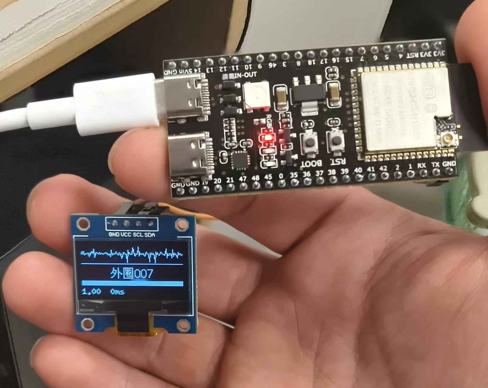

# firmware v1.5 · ESP32-S3 流式诊断

> **叠甲一句话**: 下述为虚构工作场景, 精度数据来自软件模拟 (我没试验台也没传感器), 完整免责见文末.

## 虚拟小故事

某日, 我正在无所事事的躺着摸鱼, 突然, 领导推门进来, 扔给我一个需求: "小康啊, 听说你是做故障诊断的, 我有一个绝妙的想法你要不要听一听啊?", 我心里翻个白眼: "别又是天马行空的那一套吧?", 嘴上说: "领导您说, 我猜这个想法一定可以改变世界". "厂里觉得, 咱们那条主线的传动轴承, 每隔几个月就得停机拆开来看, 虽然是固定维护, 但停一次有停一次的钱啊, 你能不能做一个东西? 不用拆, 它自己就能知道有没有什么毛病, 或者说是帮忙看看是什么毛病?" 我一听, 心里想: "居然是正经需求?"

"领导啊, 这事交给我你就放心吧, 但我需要一个基本的试验台, 然后还需要一个老师傅告诉我平时拆机都遇见的是什么故障? 能有现成的故障件那就最好了." "小康啊, 你放心, 厂里一定给你最好的支持."

后来实验台到了. 我拆箱一看, 好家伙, [IEPE 压电加速度传感器](https://www.pcb.com/contentStore/docs/pcb_corporate/vibration/products/specsheets/353b33_p.pdf), 还配一个 24 位采集卡, 这套传感器我拿去倒卖就赚不少钱, 每台设备配一个这个, 几十台设备, 鬼才配得起, 不过话说回来这个支持力度确实够. 这精度完全没得说, 12k 的带宽, 底噪 4μg/√Hz, 采出来的波形干干净净. 这时候老师傅也来了, 叼着烟告诉我说: "小伙子, 轴承故障说破天就那几种, 内圈, 外圈, 滚动体, 这些就是故障件", 我点了点头, 心里盘算着: "说着只是 4 分类, 但每种还有轻重, 学界的标杆 CWRU 就分出来 10 种, 每种故障还有粒度问题, 不过话又说回来, 准确来看也确实是 4 分类, 难道诊断出轻故障后, 还能有诊断出重度故障的机会? 但索性还是全做吧, 4 分类没什么挑战, 10 分类才好, 越多越好. 但是分清楚很容易, 单工况分类本身就容易, 真正的挑战在于未见工况的泛化以及怎么做到分的便宜. 否则只是一个神经网络调包调参就完事了, 要我干什么?"

老师傅走后, 我又盯着那套试验台想了一件事: 这台子上能跑几个转速, 但厂里的机器五花八门. A 车间的电机是 1000 rpm, B 车间 1500, C 车间要爬到 2000. 我总不能每换一个车间就重新采一套数据再训一次模型——这不叫能用. 得让模型学到**跨工况稳定的东西**: 采两个极端工况的数据训一个模型, 中间的工况没见过, 它也能判. 所以我打算在试验台上跑 0HP 和 3HP 两个负载采数据训模型, 测的时候故意流 1HP 和 2HP 两个模型没见过的负载, 看它临场发挥. 行就是行, 不行就没资格谈成本.

想好就干, IEPE 的信号喂进去, 训 0+3HP, 测全 4 个 HP, 10 分类, 严格分窗——精度约 100%, 毫不意外, 这么贵的传感器要是跑不到这个值, 我就可以找个河跳了. **held-out 的 1HP 和 2HP 也 100%**, 说明"两工况训四工况用"这条路是通的.

顺手做了一件事: 从 CFD 120 维物理特征里, 挑跨 0/3HP 分布漂移最小的 40 维 (Cohen's d 排序取尾 40), 其余 80 维扔掉——这 40 维就是**跨工况最稳的那些**, 是后面把整套东西塞进 MCU 的伏笔. 精度没掉.

<!-- [VIDEO 1: IEPE 传感器 · 全工况全量数据 · 板子实时诊断] -->

https://github.com/user-attachments/assets/1c9bb68f-8bc0-4f8d-bb4d-63cfb33c54fd

> **视频 1 · IEPE 基线** — 全 4 工况轮流跑, 板子实时诊断, OLED 显示波形 + 中文标签 + 置信度

我的脑子里想的是另一个事: 整套检测流程的成本大头在于硬件采集链路和软件平台, 前面是硬成本, 后面纯属知识赋值, 不过我要有这个技术我也收平台费, 那么刨除掉这些, 它的最低成本是多少呢? 如果我也复用这套硬件采集链路, 那么它跟现有的诊断系统有什么区别? 还是说只能服务贵的设备?

因此我决定尝试不同传感器的诊断边界, 用 IEPE 采集的信号做模拟衰减 (注: 下述精度数字均来自于模拟, 我并没有试验台, 也没有传感器, 因此技术参数来自于网上调研, 疏漏之处还望海涵), 来模拟不同传感器的特质, 看这个成本能不能被打下来? 我都决定把计算资源节省到极致了, 硬件成本搞不好还能降.

第一个是 [ADXL1002](https://www.analog.com/media/en/technical-documentation/data-sheets/adxl1001-1002.pdf), 工业级 MEMS, 带宽 11kHz, 底噪 25μg/√Hz, 模拟完喂进去, **99.8%**? 1500 窗只错了 3 窗? 说实话可以用, 搞不好还能有进一步的优化空间.

<!-- [VIDEO 2: ADXL1002 模拟降级 · 板子诊断依旧] -->

https://github.com/user-attachments/assets/99b86a52-121a-4d29-880e-056733ed09a8

> **视频 2 · ADXL1002 (工业 MEMS)** — 信号经软件降级模拟 ADXL1002 后发给板子, OLED 显示诊断基本一致

因此我模拟第二种传感器 [ADXL355](https://www.analog.com/media/en/technical-documentation/data-sheets/adxl354_adxl355.pdf) (老实说, 它的技术报告有些复杂, 要严谨的分清楚, 很费时间, 所以我直接用 1.9kHz 的带宽以及 22.5μg/√Hz 的底噪进行模拟), 同样的 MEMS, 带宽和底噪都更低, 模拟结果 **38.98%**, 我愣了一下, 但是转头一想, 带宽不够直接把包络特征丢了, 噪声再低丢了就是丢了, 这很正常.

<!-- [VIDEO 3: ADXL355 模拟降级 · 板子开始误判] -->

https://github.com/user-attachments/assets/8da2af3f-be5b-4e73-b846-f7d15ba4dd60

> **视频 3 · ADXL355 (低带宽高精度 MEMS)** — 板子诊断出现红色 MISS, 置信度掉, 带宽杀故障签名

接下来是重磅选手, 消费级选手 [MPU6050](https://invensense.tdk.com/wp-content/uploads/2015/02/MPU-6000-Datasheet1.pdf) (带宽低, 噪声高, debuff 拉满了, 按理说我不该对它抱有期待, 但是万一呢? 结果不负我所望啊), 260Hz 的带宽, 400μg/√Hz 的底噪, 精度结果 **10.17%**, 不如我蒙着眼猜.

<!-- [VIDEO 4: MPU6050 模拟降级 · 板子几乎瞎猜] -->

https://github.com/user-attachments/assets/d92f4862-c50b-4afa-9868-966a64cf7ced

> **视频 4 · MPU6050 (消费级 IMU)** — 板子诊断基本随机, 接近 10 类瞎猜的 10%

我把这些数字写在纸上, 结论很明确: **带宽是硬约束, 噪声可以用算法优化, 但信号没了就是没了**.

有了这个结论, 心里大概有了个底, 既然廉价平替可以做到, 那么 IEPE 级别的采集链路是不是也不需要? 甚至一个 ESP32-S3 都行, 想好就干, 于是淘宝花了四十几块钱, 买了一块 ESP32-S3 的开发板以及 0.96 的 OLED 屏, 一根数据线, 4 根杜邦线, 硬件齐了.

算法跑在 ESP32 上面: 120 维 CFD 特征 5ms, Bot-40 选维 + 标准化 + LR 推理 0.6ms, 整个模型 (LR 权重 + scaler + Bot-40 索引) 才 2KB 出头. 信号进来, OLED 直接显示波形, 诊断结果, 和置信度, 完事.

我把这个往桌上一放, 拍了张运行的照片 (在下面, 真的有, 有条件可以照着做, 挺好玩的), 心想: 40 多块钱的东西, 就能做到这个事, 谁敢信啊? 但是没辙, 为了可靠性, 传感器的硬件链路肯定要上好的, 但是边缘不重要的设备就无所谓了.

<!-- [PHOTO: ESP32-S3 + OLED 运行照] -->



> **照片 · 板子实物运行** — ESP32-S3 + OLED 桌面照, 屏上显示波形+"外圈007"+置信度条

---

## 我这套东西复现出来的门槛

（如果你也想复刻一份, 或者看看代码怎么写的）

**硬件** (合计 ~40 元):
- ESP32-S3-DevKitC-1 或 N16R8 变种 (~24)
- SSD1306 128×64 OLED (I2C, ~10)
- USB-C 数据线 + 4 根杜邦线 (~6)

**数据**: CWRU 轴承数据集 (公开免费, 见 [`../data/README.md`](../data/README.md)).

**三步跑通**:

```bash
# 1. PC 端训练 + 导出 model.h  (~10 秒)
python firmware_v1_5/train_export_model.py

# 2. Arduino IDE 打开 firmware_v1_5.ino, 选 ESP32S3 Dev Module, 上传

# 3. PC 流式喂数据 (自定义工况组合, 见文件顶部 CONFIG)
pip install pyserial matplotlib
python firmware_v1_5/stream_host.py
```

seed=42, 相同数据+相同 seed → 逐字节一致的 model.h, 精度可复现.

`stream_host.py` 里改一行 `SENSOR = 'ADXL1002'` 就是视频 2 的效果, 改 `'ADXL355'` 或 `'MPU6050'` 是视频 3/4, 都不用改板子上的代码.

---

## 文件对照

| 文件 | 干什么 |
|------|------|
| `train_export_model.py` | 入口: CWRU → Cohen's d 选 Bot-40 → LR 训练 → 导出 `model.h` |
| `firmware_v1_5.ino` | 板子主程序: 读窗 → 特征 → 推理 → OLED + 串口 |
| `fft.c/h`, `features.c/h` | float32 FFT + 120 维 CFD 特征 (镜像 Python 版) |
| `infer.c/h` | Bot-40 选维 + 标准化 + LR (40×10 点积 + argmax) |
| `model.h` | 训练产物 (自动生成) |
| `stream_host.py` | PC 流式主机, 支持传感器降级模拟 |

---

## 叠甲说明 (完整版)

- **精度数据是软件模拟的**, 不是真接传感器测的. 我没钱也没有试验台, 参数从各家 datasheet 上抄的, 疏漏难免.
- **现场实测会存在多种意料之外的状况**: 温漂、环境噪音、传感器安装耦合、EMI 干扰、模拟输出接 ADC 的运放前端设计、ESP32 内置 ADC 有效位低于名义 12-bit、跨机器 domain shift, 等等. 综合下来预期真机精度会从模拟的 99.8% 掉到 90-95% 范围, 甚至更低.
- **我的毕业课题也不涉及传感器和实物**, 这只是一个软件层的模拟验证, 离真正的工业化落地有很大的距离.
- **为一个小测试没必要上纲上线**——想让读者理解"这条路可行", 就够了.

也就是说: **这是一份"算法可行性 + 边缘部署可行性"的工程报告**, 不是"接上就能用的产品". 有钱有条件的话, 拿真 ADXL1002 接一支, 数字大概率会掉, 但方向不会错.
