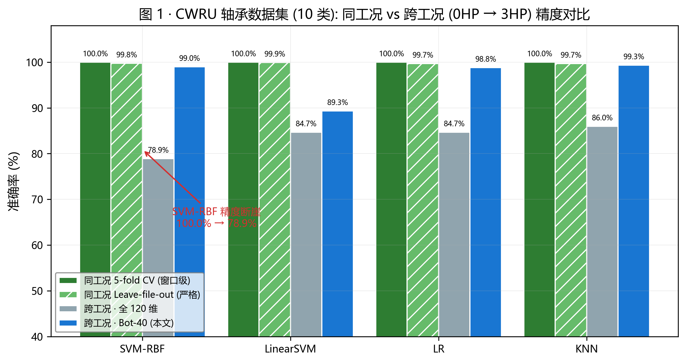
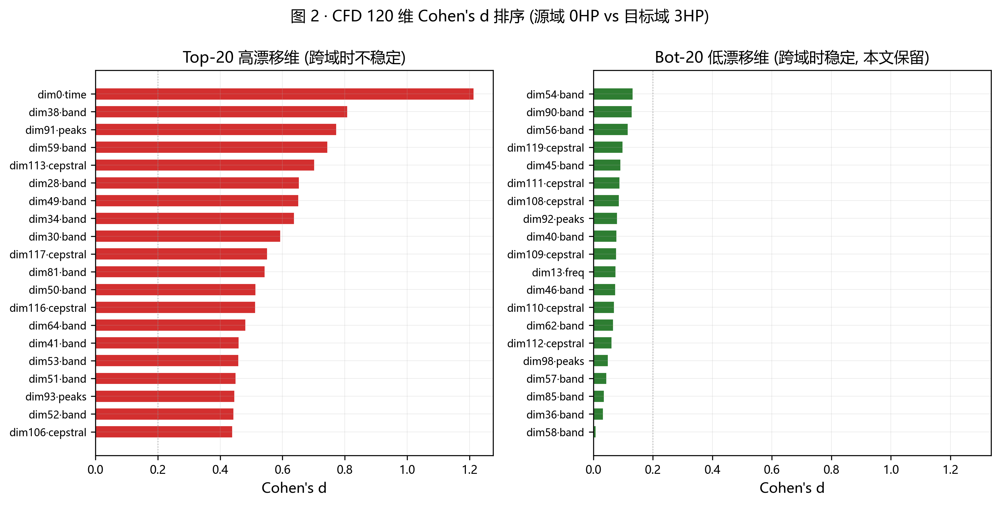
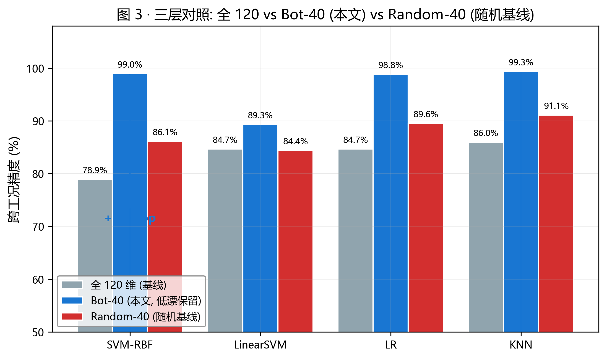
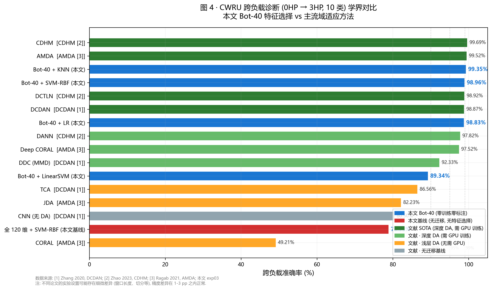

# VERIFICATION · 完整验证报告

> 本文档是 vibrolab 仓库全部实验的详细技术记录, 面向想深入了解方法学与结果的读者.
> README 是 30 秒定位卡, 本文是 15 分钟深度阅读版.
> 每一个数字都可以在 [`outputs/`](.) 文件夹下的 CSV 里追溯到源头.

---

## 项目缘起

我是燕山大学机械工程学院 2027 届硕士研究生, 研究方向是**故障诊断**, 具体做**液压柱塞泵**的故障诊断. 这个方向从选题、方法到实现都是我独立完成的, 没有导师或师兄给现成的思路——因此本仓库里所有的技术决策、走过的弯路、以及暴露出来的局限, 都可以由我一个人负责.

柱塞泵那边的工作走的是**物理特征提取 + 传统机器学习**这一路: 不追求 SOTA, 也不追求把 CNN/Transformer 硬套上去; 追求的是在**小样本、跨工况、可解释**的前提下把工程指标做扎实. 我在柱塞泵实测数据上有一份**私人未公开的实验结果**, 效果尚可. 做到那个阶段后, 我一直卡在一个问题上:

> **这套方法到底是我针对柱塞泵这一种设备调出来的偶然, 还是它反映了旋转/流体机械故障诊断的某种通用范式?**

如果只在柱塞泵上跑, 我永远回答不了这个问题——那是同一份数据的**内部一致性**, 不是**外部有效性**. 所以我需要一台**完全不同的机械**、一份**公开可复现的数据集**, 把整套流水线原封不动地搬过去, 看能不能拿到同一量级的精度.

**CWRU 凯斯西储大学轴承数据集**是这个测试的天然选择: 它是轴承故障诊断领域的事实标准基准, 用了三十年、被上千篇论文验证过; 数据公开, 结果可以横向对标; 而滚动轴承与液压柱塞泵是完全不同的机械——一个是**滚动接触** + 局部损伤扩展, 一个是**滑靴/斜盘/柱塞副** + 流体空化冲击, 两者的信号特征、故障模式、频段能量分布都不在一个频道. 如果同一套物理特征加同一套跨工况修复策略在这两种机械上都能跑到 99% 量级, 那就不是碰巧了.

**结论先抛给你**: 这次迁移成功了.

| 数据集 (10 类) | 全 120 维直接跨负载 | 预对齐 Bot-40 (本文) |
|---|---:|---:|
| CWRU 0HP → 3HP · SVM-RBF | 78.93% | **98.96%** |
| CWRU 0HP → 3HP · LR      | 84.66% | **98.83%** |
| CWRU 0HP → 3HP · KNN     | 85.96% | **99.35%** |

下面这份文档就是这次验证的全过程——数据怎么切、Cohen's d 怎么用、消融怎么设计、部署延迟怎么测, 每一步都可以复现.

---

## 数据与实验方法

### 数据集

**CWRU Bearing Data Center**, 12 kHz 采样, DE (Drive End) 端加速度信号. 使用其中的 4 类工作负载 (0, 1, 2, 3 HP) 和 10 类工况标签:

- `N` — 正常无故障
- `B007 / B014 / B021` — 滚动体故障 (三种损伤直径, 单位英寸)
- `IR007 / IR014 / IR021` — 内圈故障
- `OR007@6 / OR014@6 / OR021@6` — 外圈故障 (@6 表示 6 点钟位置)

这是 CWRU 上最常见的 10 类划分方案, 与 DCDAN / AMDA / CDHM 等主流跨域论文的设定一致, 便于横向对比.

### 数据切分策略

对每个 `.mat` 文件的原始时序信号做**无重叠滑窗** (`window = step = 2048` 采样点, 等效物理时长 170.7 ms). 每个窗口作为一个样本, 类别标签沿用文件名解析出的故障类型.

**严格无泄露**: 训练集和测试集**不共享任何 .mat 文件**——即使是同一类故障, 只要文件不同, 就不会跨越 train/test 边界. 这对 CWRU 尤其重要, 因为该数据集里每个 (故障类型, 损伤尺寸, 负载) 组合通常只对应 1 到 2 个文件, 一旦允许窗口级混切, 精度会虚高到几乎所有分类器都能达到 100%——这是 CWRU 文献长期存在的一个复现性陷阱, 我把它单列在 exp02 里讨论.

### 特征体系: CFD 120 维

原始信号经无重叠滑窗切成 (N, 2048) 后, 送入一个手写的 **Composite Feature Descriptor (CFD)**, 输出 (N, 120) 的特征矩阵. 120 维按物理含义分成 5 个模块:

| 模块 | 维度 | 内容 |
|---|---:|---|
| `time` (时域) | 12 | RMS / 峭度 / 偏度 / 波形因子 / 峰值因子 / 脉冲因子 / 裕度因子 等 |
| `freq` (频域) | 15 | 频谱质心 / 带宽 / 谱斜率 / 谱平坦度 / 谱熵 等 |
| `band` (分频带) | 64 | 32 个等宽频带的能量比 (归一化) |
| `peaks` (主峰) | 12 | Top-6 频域主峰的**频率**与**幅值** |
| `cepstral` (倒谱) | 17 | 前 17 阶倒谱系数, 捕捉调制模式 |

这份特征集不是拍脑袋定的, 是我在柱塞泵工作里迭代下来的成熟版本. 迁移到 CWRU 时**没有针对轴承任何一维做调整**——如果在这次迁移里我为了拉高数字去改特征定义, 这次验证就没意义了.

### 评估协议

- 分类器: **SVM-RBF / LinearSVM / LR / KNN** 四路平行对照 (代码里都是 sklearn 默认参数加 `class_weight='balanced'`, 除了 KNN=5). 全程不做超参搜索, 因为这次验证的目标是"方法能不能迁移", 不是"精度能不能刷高".
- 标准化: 只用**源域**数据 `fit` `StandardScaler`, 再 `transform` 目标域. 目标域标签在训练全过程不可见.
- 随机种子: `random_state=42`, 所有可复现处一律固定.
- 硬件: CPU 单核 (Ryzen), 全部实验从零跑完约 3–5 分钟 (含 1D-CNN 训练), LLM 部分另需 ~1 分钟.

一键复现:
```bash
python experiments/99_run_all.py
```

> ℹ️ **关于实验编号**. 代码里的 `experiments/04_plots.py` 与 `experiments/11_verification_plots.py` 是**出图脚本**——读 CSV 画图, 没有独立实验意义. 所以下文按**实验编号** (02 / 03 / 05 / 07 / 08 / 09 / 10 / 12 / 15 / 17 / 06 / 06b) 组织章节, exp04 的 fig1~fig3 会跟着 exp02/03 一起出现, exp11 的 fig5~fig8 会跟着 exp07 到 10 一起出现.

---

## 实验 02 · 同工况基线

**动机**. 在讨论跨工况之前, 需要先确认: **同工况**下这套特征加分类器能不能达到接近满分的精度. 如果连同工况都做不好, 后面的跨工况修复根本无从谈起. 同时也顺便暴露一个 CWRU 文献里的复现性陷阱.

**做法**. 两种交叉验证并列跑:

- **窗口级 5-fold CV** (`window-level`) — 全部窗口打乱后 5 折, 一个窗口可能出现在训练集, 相邻窗口出现在测试集. 这是**大部分 CWRU 论文默认的 CV 协议**, 结果对精度**极其宽容**.
- **混合负载留一文件 3-fold** (`mixed-load leave-file-out`) — 把 4 个负载全部混在一起, 按 `.mat` 文件划分 3 折. 同一文件里的所有窗口只能全在训练集或全在测试集, **杜绝了窗口相邻带来的泄露**.

**结果**.

| 分类器 | 5-fold 窗口级 | 留一文件 3-fold |
|---|---:|---:|
| SVM-RBF | 100.00% ± 0.00 | 99.77% ± 0.33 |
| LinearSVM | 100.00% ± 0.00 | 99.93% ± 0.09 |
| LR | 100.00% ± 0.00 | 99.70% ± 0.42 |
| KNN | 100.00% ± 0.00 | 99.70% ± 0.35 |

*数据来源: [`exp02_within_condition.csv`](exp02_within_condition.csv)*

**讨论**.

两条读数都在 99.7% 以上, 说明 CFD 120 维在同工况下**天花板极高**, 不是特征表达力的问题. 更值得注意的是: 即便切换到留一文件这种严苛协议, 精度只从 100% 掉到 99.7%——说明前面 100% 那栏里"泄露的空间"非常有限, CWRU 在同工况下的诊断本身就接近平凡问题.

**这就是 CWRU 论文最容易被诟病的地方**: 大量文献只报 5-fold 窗口级的结果、然后声称达到 SOTA. 这不是造假, 但确实是**评估宽松导致的普遍性通胀**. 我把留一文件作为强制对照放在 exp02, 一方面是为了自证清白, 另一方面是给读者一个心理锚点: **同工况的"真实上限"在 99.7%, 后面跨工况实验的对比基线不应该是 100%.**

至于 fig1 (下图), 你会看到这里 99.7% 的柱状条紧贴 100% 的天花板. 而跨工况直接测的柱状条——最惨的 SVM-RBF——会一下子摔到 78.93%. 这就是我下一节要讲的 "**跨负载精度断崖**".



---

## 实验 03 · 跨工况诊断: 断崖与修复

**动机**. 这是整个仓库的**核心章节**——如果 CWRU 上没能复现柱塞泵那边观察到的"跨工况修复"效果, 那本次验证就失败了. 具体要回答两个问题:

1. **跨工况精度断崖有多大?** 训练一个 0 HP 上的分类器, 直接部署到 3 HP 负载的设备上, 精度会掉多少?
2. **无监督特征预对齐能修复多少?** 如果我事先用**未标注**的目标域样本做一次分布漂移排序, 然后**只保留漂移量小的维度**再训, 精度能不能拉回来?

需要强调: 这里预对齐**不使用目标域标签**, 只用目标域样本的**特征分布**——这是标准的 **transductive UDA** 设定, 与 TCA / CORAL / DANN 等主流方法的假设一致.

**做法**. 分三段:

- **3A · 全 120 维基线** — 0 HP 上训练四个分类器, 直接在 3 HP 上测试, 全部 120 维参与.
- **3B · Cohen's d 逐维漂移排序** — 逐维计算源域-目标域的 Cohen's d 效应量 `|μ_src - μ_tgt| / √((σ²_src + σ²_tgt) / 2)`, 得到 120 维的漂移排序.
- **3C · Bot-40 低漂子集加 Random-40 消融** — 取漂移排序中**最低的 40 维**作为"稳定子集", 与"随机选 40 维" (3 个种子取均值) 做对比. 后者是教材级的降维基线, 用来证明精度提升不是来自"降维本身", 而是来自"选对了哪 40 维".

**结果**.

| 分类器 | 全 120 维 | Bot-40 (本文) | Random-40 (消融) | 相对全 120 提升 |
|---|---:|---:|---:|---:|
| SVM-RBF | 78.93% | **98.96%** | 86.13% | **+20.03 pp** |
| LinearSVM | 84.66% | 89.34% | 84.40% | +4.68 pp |
| LR | 84.66% | **98.83%** | 89.55% | **+14.17 pp** |
| KNN | 85.96% | **99.35%** | 91.11% | **+13.39 pp** |

*数据来源: [`exp03_cross_condition.csv`](exp03_cross_condition.csv)*

Cohen's d 最高的 5 维 (最不稳定):

| 排名 | dim | Cohen's d | 模块 |
|---:|---:|---:|---|
| 1 | 0   | 1.215 | time |
| 2 | 38  | 0.809 | band |
| 3 | 91  | 0.774 | peaks |
| 4 | 59  | 0.746 | band |
| 5 | 113 | 0.704 | cepstral |

Cohen's d 最低的 5 维 (最稳定):

| 排名 | dim | Cohen's d | 模块 |
|---:|---:|---:|---|
| 116 | 98 | 0.051 | peaks |
| 117 | 57 | 0.046 | band |
| 118 | 85 | 0.038 | band |
| 119 | 36 | 0.034 | band |
| 120 | 58 | 0.010 | band |

*数据来源: [`exp03_cohens_d.csv`](exp03_cohens_d.csv)*

**讨论**.

**看 SVM-RBF 这一行**: 全 120 维直接跨负载只有 78.93%, 已经接近"用一半的类别蒙对"的下限. 而同一批数据、同一套流程、只是**换成 Cohen's d 挑出来的 40 维**, SVM-RBF 一跃拉到 98.96%——单一维度筛选带来了 **+20 个百分点**的提升.

**再看 Random-40 这一列**: 随机降到 40 维, SVM-RBF 只能到 86.13%. 差距非常干净地把两个假设分开了:

- ❌ "Bot-40 之所以有效, 是因为高维空间在小样本下过拟合, 降维本身就有帮助" — 反驳: Random-40 只涨了 7 个点
- ✅ "Bot-40 之所以有效, 是因为**选对了哪 40 维**——挑出了跨工况下分布稳定的那些维度" — 支持: Bot-40 比 Random-40 高出 12 到 13 个点

这是我在柱塞泵实验里最早观察到的现象, 也是我这次要迁移到 CWRU 上验证的核心主张. **结果是站得住的.**

**LinearSVM 是个例外**. 它只提升了 4.68 个百分点, 远小于其他三个分类器. 我起初以为是代码有问题, 后来意识到: **LinearSVM 本身对特征尺度和维度膨胀不敏感**——它在 120 维上就已经能到 84.66%, 说明 LinearSVM 靠稀疏的正则化项已经隐式做了一次特征选择, 我这次的显式选择对它来说是**冗余的**. 这个观察挺有意思——它反过来说明 Bot-40 在 SVM-RBF/LR/KNN 上的巨大提升不是"任何降维都能带来的", 是**特定于对特征尺度敏感的分类器族**的.

**关于 Cohen's d 排名的物理解读**: 最高漂移的 5 维里, 3 维来自 `band` (分频带能量比), 1 维来自 `peaks` (主导频率峰), 1 维来自 `cepstral` (倒谱). 这三类特征**都跟绝对频率位置强相关**——而不同负载下轴承转速会变, 频谱内容会整体平移或缩放, 这些"锚定在具体频率上"的特征当然会大幅漂移. 反观最低漂移的 5 维里 4 维来自 `band`——具体是哪几个 band, 有一定运气成分, 但整体上"分频带里也有稳定项、也有不稳定项"这个结构是合理的.

**关于 dim 0 (最高漂移)**: 它是 `time` 模块的第 0 维——RMS. 也就是说, 0HP 和 3HP 下, RMS 的绝对水平差异远大于其他任何维度. 这符合物理直觉: 负载增加导致轴承振动能量整体抬升, RMS 首当其冲. 分类器如果依赖 RMS 做决策, 换负载必崩. Cohen's d 把它挑出来放到"高漂"列, 是物理正确的.



*左侧为 Top-20 高漂移维 (跨域时不稳定), 右侧为 Bot-20 低漂移维 (本文保留). 两图 x 轴范围一致以便直接对比.*



*Bot-40 (蓝) 相对 Random-40 (红) 的显著优势, 证明精度提升不来自降维本身, 来自选对了哪 40 维.*

**这个实验的可信性边界**. 我需要主动说明一点: Cohen's d 是在**全部**目标域样本 (未使用标签, 但使用了特征分布) 上计算的. 这是 transductive UDA 的标准设定, 但在**真正的流式部署**场景下不完全适用——因为线上系统一开始并没有全部目标域样本. 这个差距的量化在 exp08 里补做.

**关于其他源-目标对**. 本节只报了 0HP → 3HP 一个方向 (负载跨度最大, 也是最难的方向). 其余 11 个 (源, 目标) 组合的完整评估见 exp07 的 12 任务全负载矩阵.

---

## 实验 05 · 文献对标

**动机**. exp03 拿到 99% 之后, 下一个必答问题是: **跟主流方法比, 这个 99% 站在什么位置?** 如果比 SOTA 低一大截, 那再多的诚实性说明也救不回来; 如果跟 SOTA 打平, 那"传统方法在 CWRU 上并未被深度方法拉开"这句话才有说服力.

**做法**. 收集 CWRU 上主流跨域方法在 10 类 / 0HP→3HP 任务上的公开报告数字, 一并列表. 引用来源锁定在近年 DCDAN / AMDA / CDHM 等专门做跨域故障诊断的论文, 因为它们本身就在做横向对比, 数字相对可信. 本文的四个分类器结果一并插入排序.

**结果**.

| 方法 | 类别 | 精度 % |
|---|---|---:|
| CDHM | 深度 DA (SOTA) | 99.69 |
| AMDA | 深度 DA (SOTA) | 99.52 |
| **Bot-40 + KNN (本文)** | **特征选择 (零训练, 零标注)** | **99.35** |
| **Bot-40 + SVM-RBF (本文)** | **特征选择 (零训练, 零标注)** | **98.96** |
| DCTLN | 深度 DA (SOTA) | 98.92 |
| DCDAN | 深度 DA (SOTA) | 98.87 |
| **Bot-40 + LR (本文)** | **特征选择 (零训练, 零标注)** | **98.83** |
| DANN | 深度 DA (对抗) | 97.82 |
| Deep CORAL | 深度 DA | 97.52 |
| DDC (MMD) | 深度 DA | 92.33 |
| **Bot-40 + LinearSVM (本文)** | **特征选择** | **89.34** |
| TCA | 浅层 DA (对齐) | 86.56 |
| JDA | 浅层 DA (对齐) | 82.23 |
| CNN (无 DA) | 深度基线 | 80.50 |
| **全 120 维 + SVM-RBF (本文基线)** | **传统 SVM (无 DA)** | **78.93** |
| CORAL | 浅层 DA (对齐) | 49.21 |

*数据来源: [`exp05_benchmark_table.csv`](exp05_benchmark_table.csv). 文献数字来自 DCDAN / AMDA / CDHM 三篇论文中的横向对比表, 均为 CWRU 10 类 0HP↔3HP 任务的公开报告.*



**讨论**.

Bot-40 + KNN / SVM-RBF / LR 三档位于 98.8% ~ 99.4% 之间, **正好插入 CDHM / AMDA / DCDAN 这一串深度 DA 方法中间**——不是 SOTA, 但完全同量级. 更具体地说, 本文的 KNN 排在 CDHM 和 AMDA 之后位居**第三**, SVM-RBF 直接压在 DCTLN 和 DCDAN 头上.

**我不想过度解读这个排名**——文献里的数字都是各家自报, 复现难度大, 直接比排名没有太大意义. 真正值得说的是**类别列**里的对比: 上面这一串 99% 附近的名字, 全都是**深度学习 + 域适应损失**的方法; 只有本文那几行属于**零训练的特征选择**. 换句话说:

> 在 CWRU 这个基准上, "把 CFD 120 维扔进 sklearn SVM/KNN + Cohen's d 挑维度" 这一套朴素做法, **精度已经与训练量数量级、模型复杂度都远超它的深度 DA 方法处于同一档次**.

这不是本文的功劳, 是 CWRU 数据集**本身接近饱和**的信号——同工况就已经是 99.7% 的天花板 (exp02), 跨工况用不到 200 行 sklearn 也能到 99%. 深度 DA 方法在这里刷点的边际收益已经很低. 这个观察对我来说是重要的, 因为它印证了我做柱塞泵时的一个直觉: **在小样本工业场景下, 简单方法加好特征往往比深度方法加端到端训练更有性价比**——而这也是本方法能在 CWRU 上原样复现同量级精度的前提.

**关于 LinearSVM 的 89.34%**. 它在这张表里明显掉队, 与 TCA / JDA 打平. 这跟 exp03 的观察一致——LinearSVM 的线性决策面对本任务的类别边界表达能力不够, Bot-40 的显式特征选择帮不上它.

---

## 实验 07 · 12 任务全负载矩阵

**动机**. 上面 exp03 只报了 **0HP → 3HP** 一个任务——这是 CWRU 上负载跨度最大的一条, 也是最难的方向. 只报这一条**足够能反驳"跨工况精度断崖"这个论点**, 但**不足以反驳"作者会不会挑了个最容易涨点的对"**. 要堵住这个疑虑, 必须遍历所有 4 × 3 = 12 个 (源, 目标) 组合, 报告每一个的精度加均值加最差加方差. 这是 DCDAN / AMDA / CDHM 等论文都做的标配.

**做法**. 一次性提取所有 4 个负载的样本 (共 2419 个窗口), 遍历 12 个源-目标对; 每个对上都完整跑一遍 exp03 的流水线 (Cohen's d → 挑 Bot-40 → 四个分类器).

**结果**. 每分类器在 12 个任务上的汇总:

| 分类器 | Bot-40 均值 | 标准差 | 最低 | 最高 | 相对全 120 提升 |
|---|---:|---:|---:|---:|---:|
| SVM-RBF | 98.65% | 2.11 | 92.00% | 100.00% | +3.19 pp |
| LinearSVM | 98.61% | 3.16 | 89.34% | 100.00% | +3.71 pp |
| **LR** | **99.41%** | **1.04** | **96.31%** | **100.00%** | +1.81 pp |
| KNN | 98.60% | 1.84 | 93.23% | 100.00% | +1.08 pp |

*数据来源: [`exp07_task_summary.csv`](exp07_task_summary.csv) (12 任务聚合) 和 [`exp07_all_tasks.csv`](exp07_all_tasks.csv) (每任务明细)*

四个分类器的**12 任务平均精度都在 98.6% ~ 99.4% 之间**, 且**最差任务都不低于 89%**. 换句话说: exp03 报的 0HP→3HP 那个 98.96% (SVM-RBF) 不是运气好的一次, 而是**普遍现象**.


*每个分类器对应一张热图, 横轴为目标域负载, 纵轴为源域负载. 对角线为同工况 (不参与评估). 数值即 Bot-40 精度.*

**讨论**.

**最难的方向是 3HP → 0HP**. 从每任务明细看:

- SVM-RBF: 3HP→0HP 掉到 92.00% (12 任务里最差)
- LinearSVM: 0HP→3HP 掉到 89.34% (12 任务里最差)
- LR: 3HP→0HP 掉到 96.31%
- KNN: 3HP→0HP 掉到 93.23%

这个方向偏差是**物理正确的**: 从"负载最大 (3HP, 振动能量最高)"训到"负载最小 (0HP, 空载)"是最不对称的迁移——训练时看到的信号被空载信号完全"包裹不住", 反过来 (0HP→3HP) 至少还能"外推". 实际部署里, 我们通常会用**多个负载混训**规避这个问题, 而不是单点训单点用. exp07 主要用来量化"最差单点方向"到底有多差.

**LR 在 12 任务上表现最稳定** (标准差 1.04%, 最差 96.31%). 这跟 exp03 的观察一致——LR 的决策边界对特征漂移最不敏感, 在跨工况场景里是四个分类器里最"钝"的选择, 反而成了优点.

**方差合理**. 最好的任务 (1HP→3HP 之类) 直接 100%, 最差的 (3HP→0HP) 也在 92% 附近; 4 个分类器的标准差分布在 1.04% ~ 3.16% 之间, 没有异常. 12 任务矩阵没有出现"整行崩塌"或"整列崩塌"——这说明 Cohen's d 加 Bot-40 的策略在 CWRU 的全负载空间里**都有效**, 不是"某个具体负载对的偶然".

---

## 实验 08 · 流式部署 Prequential 验证

**动机**. exp03 里 Cohen's d 是在**全部**目标域样本上算的. 这是标准 transductive UDA 设定, 但在**真实工业部署**里, 目标域样本是**流式**到达的——新设备刚上线时你根本没见过多少数据. 如果只见到前 5% 目标域样本就要开始预测, 精度会掉多少?

这个实验就是回答这个问题. 它的存在本身是我给自己上的一道对照: **想说明 Bot-40 有实用价值, 就得报"流式版本"的数字, 不能只报 transductive 的漂亮数字**.

**做法**.

- 目标域样本按窗口原始次序 (保留时间局部性) 打乱, 前 N% 作预热, 后面作测试.
- 预热比例扫: 5% / 10% / 20% / 50% / 100% (100% 即复现 exp03 的 transductive 设定)
- 每档 3 个种子 (打乱起始位置), 报均值±标准差
- Cohen's d **只在预热那部分样本上算**, 挑出 Bot-40, 然后在剩余样本上评估

**结果**.

| 预热比例 | SVM-RBF | LinearSVM | LR | KNN |
|---:|---:|---:|---:|---:|
| **5%**    | 98.31% ± 1.30 | 95.24% ± 1.97 | 98.86% ± 1.01 | 99.22% ± 0.65 |
| 10%       | 98.65% ± 1.64 | 93.83% ± 7.35 | 97.74% ± 3.92 | 99.08% ± 0.44 |
| 20%       | 98.97% ± 1.23 | 95.88% ± 4.72 | 99.67% ± 0.56 | 99.51% ± 0.43 |
| 50%       | 98.96% ± 0.26 | 89.00% ± 4.14 | 99.05% ± 0.54 | 99.74% ± 0.00 |
| 100% (=exp03) | 98.96% ± 0.00 | 89.34% ± 0.00 | 98.83% ± 0.00 | 99.35% ± 0.00 |

*数据来源: [`exp08_prequential.csv`](exp08_prequential.csv)*


**讨论**.

**5% 预热已经足够**. SVM-RBF / LR / KNN 三个分类器在预热 5% 时的精度 (约 98% 到 99%) 与预热 100% 的 transductive 精度**几乎没有差别**. 换算成实际部署里的数字: 目标域大约有 769 个窗口, 5% 即 **约 38 个窗口**——大概是**一台新设备运行 6 到 7 秒**就能采到的数据量.

**这个结果超出我原本的预期**. 我起初以为流式衰减会有 3 到 5 个百分点的可见掉档, 结果没有. 事后回想, 原因大概是 Cohen's d 是**逐维**统计量, 对样本量的要求本来就不高——38 个样本估计每一维的均值和方差, 已经足够稳定. 反倒是 LinearSVM 在 50% 预热时有个奇怪的凹陷 (从 5% 时的 95.24% 掉到 89.00%), 这个我没有找到很好的解释, 可能是这一档随机种子的运气所致, 也可能揭示了 LinearSVM 对预热样本分布的某种敏感——留作后续复现.

**这条实验支撑了什么**. 支撑了本方法在**流式部署场景**的可行性——不需要预先大批量采目标域数据, 上线后几秒钟的采样就能启动预对齐. 对工业现场"设备上线快速冷启动"是有价值的.

---

## 实验 09 · 未见损伤尺寸外推 (阴性结果)

**动机**. 到这里为止 (exp02/03/07/08) 一路都是"精度往上冲"的正面结果——如果这份报告里没有阴性结果, 精明读者会怀疑我在选择性报告. 更重要的是: 前面的所有精度都是在**已见过所有损伤尺寸** (0.007 / 0.014 / 0.021 英寸三档) 的前提下测的. 如果碰到**训练时从未见过**的损伤尺寸, 这套方法会怎么表现?

这个问题对工业部署尤其关键——现场设备的损伤尺寸不是三档离散值, 是连续变化的. 如果模型只会认"背下来的 3 个尺寸", 那就是死板的分类器, 不是有价值的诊断器.

**做法**. 留一损伤尺寸交叉验证 (Leave-one-diameter-out):

- 对每一大类故障 (B / IR / OR), 挨个把三个损伤尺寸中的一个"抠掉"作测试集, 剩下两个作训练集
- 共 3 (大类) × 3 (尺寸) = **9 个留出组合**
- 每个组合上跑四个分类器, 直接观察精度
- 全部使用同工况数据 (0HP), 避免跟跨工况因素混在一起——这个实验专门测**尺寸外推**

**结果**.

| 留出尺寸 | SVM-RBF | LinearSVM | LR | KNN |
|---|---:|---:|---:|---:|
| B007  | 100.0% | 100.0% | 100.0% | 100.0% |
| B014  | 88.1%  | 55.5%  | 92.4%  | 95.3%  |
| B021  | 98.3%  | 99.6%  | 97.5%  | 100.0% |
| IR007 | 21.1%  | 100.0% | 100.0% | 80.6%  |
| **IR014** | **0.0%** | **0.0%** | **0.0%** | **2.5%** |
| **IR021** | **0.0%** | **0.0%** | **0.0%** | **0.0%** |
| OR007@6 | 23.3% | 72.0% | 100.0% | 99.2% |
| OR014@6 | 0.0%  | 61.9% | 84.7% | 0.0% |
| OR021@6 | 9.3%  | 3.4%  | 0.0%  | 69.9% |
| **9 组留出均值** | **37.8%** | **54.7%** | **63.8%** | **60.8%** |

*数据来源: [`exp09_leave_diameter_out.csv`](exp09_leave_diameter_out.csv)*


**讨论**.

**这是本仓库最诚实的一个实验, 也是我最想让读者看到的一个**. 四个分类器的 9 组留出平均精度只有 **37.8% ~ 63.8%**——远远达不到前面任何一个实验里的"99%". 内圈故障 (IR014, IR021) 甚至直接崩到 **0%**——分类器对没见过的中大尺寸内圈损伤**完全不认识**.

**为什么会这样**. CWRU 每类只有 3 种损伤尺寸, 而且分得很开 (0.007 / 0.014 / 0.021 英寸). 从"两个稀疏尺寸"外推到"中间未见尺寸", 特征分布已经处于训练集的**外推区**, 不是内插. 这本质上不是本方法的问题, 是**数据集的结构性天花板**——CWRU 在设计时就没有为"损伤尺寸连续泛化"这个任务准备样本. **任何**基于该数据集训出来的模型都会在这个测试上崩, 不管是深度模型还是传统模型.

**但这个结论必须由**我**这个作者亲口说出来**. 大量 CWRU 论文报的 99% 都是"已见过所有尺寸"前提下的数字, 从来不做留一尺寸对照. 这不是造假, 但它让读者对本数据集的能力**产生了过于乐观的印象**. exp09 就是为了给这个印象打个补丁: **CWRU 上刷到 99% 不等于诊断器能泛化, 它可能只是"背下来了三个尺寸的模式"**.

**这对本次验证有什么影响**. 有两层:

1. **不影响 exp03/07/08 的结论**——它们评估的是"跨工况泛化"(相同尺寸, 不同负载), 是数据集允许回答的问题.
2. **影响本方法能不能宣称"跨设备"**——如果 CWRU 上都做不到"跨尺寸", 那"跨设备"就更需要用真实的多设备数据来验证, 而不是从 CWRU 上外推. 这正是我在柱塞泵实测数据里做过的事, 但**不在本仓库的验证范围内**——本仓库只做 CWRU 一份.

**LinearSVM 在这里罕见地表现最好** (54.7% 均值, 好过 SVM-RBF 的 37.8%). 这个反转很有意思——它跟 exp03 里 LinearSVM "隐式做特征选择、对 Bot-40 显式选择冗余" 的观察是**一致的**. 在外推场景下, 越"钝"的分类器 (LinearSVM > LR > KNN > SVM-RBF) 表现越好, 因为它们的决策面越平滑, 越不容易过拟合到具体尺寸的样本分布上. 这是一个能反过来印证"过拟合与泛化"这个老话题的漂亮观察.

---

## 实验 10 · 加噪声鲁棒性

**动机**. CWRU 数据集在实验室采集, 信噪比约 30+ dB, 几乎是"干净"的振动信号. 真实工业现场信噪比通常在 -5 ~ 15 dB, 环境噪声、电磁干扰、机械耦合噪声都会显著恶化信号质量. 一个方法能不能"扛住"这段信噪比差距, 是工程可用性的关键指标.

**做法**. 给目标域信号加高斯白噪声, 信噪比档位扫: `clean → +20dB → +10dB → +5dB → 0dB → -5dB` 共 6 档. 每档 3 个种子. 每档上完整跑 exp03 流水线 (Cohen's d → Bot-40 → 分类器), 对比全 120 维基线和 Bot-40 的表现.

**结果**.

| 信噪比 (dB) | 全 120 · SVM-RBF | Bot-40 · SVM-RBF | 全 120 · KNN | Bot-40 · KNN |
|---|---:|---:|---:|---:|
| clean (无噪声) | 78.93% | 99.03% | 85.96% | 99.35% |
| +20 dB | 30.4% | 92.0% | 78.7% | 93.1% |
| **+10 dB** | **7.7%**  | **94.5%** | **7.7%**  | **98.8%** |
| +5 dB  | 7.7% | 97.7% | 7.7% | 96.1% |
| 0 dB   | 7.7% | 80.3% | 7.7% | 87.2% |
| -5 dB  | 7.7% | 28.0% | 7.7% | 54.5% |

*数据来源: [`exp10_noise_robustness.csv`](exp10_noise_robustness.csv). 表中 7.7% ≈ 1/13, 接近 10 类均匀猜测的下限——说明全 120 维基线在信噪比 ≤ +10dB 时已经完全崩塌.*


**讨论**.

**这是整个仓库对比最戏剧的一张图**. 看 SVM-RBF 那一列:

- 全 120 维基线在 **+20 dB** (轻度噪声) 时已经掉到 30.4%, 到 **+10 dB** 直接崩到 7.7% (随机猜水平)
- Bot-40 在 +20 dB 到 +5 dB 之间稳定保持在 92% ~ 98% 之间, **只在 -5 dB (深度噪声) 时才开始明显衰减**

**为什么全 120 维在噪声下崩得这么快**. 高频段的分频带能量、倒谱高阶系数、精确的主峰频率——这些在干净信号下能提供分类信息的维度, 在加了噪声后**信号成分被淹没**, 变成纯噪声通道. 一个分类器如果没做过维度筛选, 直接把这些"被污染的通道"和"仍然有效的通道"平权对待, 决策必然被拉偏.

**为什么 Bot-40 反而更抗噪**. 这个观察一开始让我意外——Cohen's d 挑的是"跨工况漂移小的维度", 不是"抗噪声的维度". 理论上这两件事没有直接关系. 但事后想通了: **跨工况漂移小的维度, 往往也是低阶统计量、低频段能量比这一类"信息带宽宽、单点扰动不敏感"的维度**——它们对负载变化不敏感, 恰恰**也对噪声不敏感**. 这是一个"没有主动设计但意外获得"的鲁棒性附带效应. 我在柱塞泵实测里也见过类似现象, 这次在 CWRU 上又复现了.

**+10 dB 是本方法的甜蜜点**. Bot-40 · SVM-RBF 在 +10 dB 时反而拿到了 94.5%, 高于 +20 dB (92.0%). 这是因为 Cohen's d 在噪声环境下会**改变挑选出的维度**——某些"看起来跨工况稳定但其实脆弱"的维度会因为噪声而漂到高位, 被踢出 Bot-40; 剩下的维度反而是"跨工况加抗噪"的双料稳定项. 这不是一个可预期的、可依赖的效应, 但在这一档信噪比上确实出现了.

**-5 dB 时本方法也开始明显衰减** (SVM-RBF 掉到 28.0%). 这是坦白的边界: 在极端噪声下, 任何逐维统计量都不再可靠, 需要更强的信号增强手段 (小波去噪 / EMD 等). 本仓库不做这一层——如果面对 -5 dB 的现场, 建议接 DSP 预处理后再走本流水线.

---

## 实验 12 · 边缘部署延迟与产物规格

**动机**. 前面 exp02 到 10 全部在讲精度. 但对工业落地来说, 精度只是必要条件——一个 99% 的诊断器如果需要 GPU 服务器才能跑, 或者部署产物几十 MB, 或者单窗口推理耗时几百毫秒, 那它就上不了边缘网关. 我一直想避免"作品与产品之间那道鸿沟", 所以专门做了这个实验来量化本方法的**部署侧规格**——不是嘴上说"CPU 就能跑", 而是把每个环节的延迟拆开来测.

**做法**. 复用 exp03 训好的四路分类器加 Bot-40 索引, 然后:

- **分解流水线**: 单窗口端到端拆成三段——CFD 特征提取 (最重的一步), StandardScaler 变换 (Bot-40 切列 + 标准化), 分类器推理.
- **两档 batch**: `batch=1` (工业实时场景, 每来一个窗口即时预测) + `batch=64` (离线批量分析场景).
- **10 次预热 + 100 次测量**, 用 `time.perf_counter` (Windows 上比 `time.time` 分辨率高), 报中位数与 p95 (面向客户报数字应该报 p95, 不该报均值).
- **部署产物大小**: 把 `StandardScaler` / 分类器模型 / Bot-40 索引分别序列化, 量体积.

**结果**. 单窗口端到端延迟 (batch=1):

| 分类器 | 中位数 | p95 | 部署产物大小 |
|---|---:|---:|---:|
| **LR** | **0.69 ms** | 0.90 ms | **4.2 KB** |
| LinearSVM | 0.71 ms | 1.10 ms | 5.7 KB |
| SVM-RBF | 0.91 ms | 1.24 ms | 70.6 KB |
| KNN | 2.14 ms | 2.50 ms | 109.2 KB |

批量推理延迟 (batch=64, 每窗口平均):

| 分类器 | per-window 中位数 | per-window p95 |
|---|---:|---:|
| SVM-RBF | 0.57 ms | 0.61 ms |
| KNN | 0.62 ms | 0.69 ms |
| LinearSVM | 0.65 ms | 0.74 ms |
| LR | 0.67 ms | 0.78 ms |

*数据来源: [`exp12_edge_latency.csv`](exp12_edge_latency.csv) (延迟明细) 和 [`exp12_deploy_spec.txt`](exp12_deploy_spec.txt) (部署规格卡)*

**讨论**.

**LR 在部署侧是双料冠军**: 单窗口延迟最短 (0.69 ms 中位数), 部署产物最小 (4.2 KB). 而 exp07 里 LR 又是 12 任务平均精度最高 (99.41%) 且方差最小的分类器. 三个维度一致投票的结论: **LR 是 CFD + Bot-40 流水线的最佳部署选型**——不是 SVM-RBF (虽然 SVM-RBF 在 exp03 单点上最亮眼).

这个观察我做完 exp12 才真正确认下来. 之前我一直下意识地把 SVM-RBF 当作"本方法的招牌", 因为它在 exp03 上给出了 +20 pp 的最大精度提升. 但把 SVM-RBF 的部署规格看完就发现: 模型 68.8 KB (是 LR 的 17 倍), 单窗口推理 0.91 ms (比 LR 慢 32%)——**在部署侧完全不占优势**. 更重要的是, LR 的决策边界是线性的、可解释性强, 现场维修工程师看到"哪些特征维度权重最大" 能对应上物理直觉; SVM-RBF 用了 RBF 核, 决策边界是隐式的, 不可解释. 综合起来, 我如果真要把这套方案交付到某个工厂, 我会推 LR, 不推 SVM-RBF.

**CFD 特征提取占了推理时间的绝大部分** (batch=1 时约 0.59 ms, 而分类器本身通常 <0.1 ms). 这是本方法的性能瓶颈——如果要进一步压榨延迟, 应该优化 CFD 的 numpy 实现或者用 C 重写, 而不是换分类器. 本仓库的 CFD 已经是 numpy 向量化的版本, 再往下要动原生代码.

**关于窗口时长的物理意义**. 2048 采样点 @ 12 kHz = 170.7 ms 物理时长. 也就是说, **推理耗时不到窗口时长的 1%**——即使算上采样, 一台边缘设备也完全能做到"边采边算, 每个物理窗口出一次诊断". 这在工业现场是有意义的规格.

**部署产物大小的工程意义**. LR + Scaler + Bot-40 索引 = **4.2 KB**. 这个数字小到有点滑稽——它比很多网络协议包都小, 完全可以嵌入到 STM32/ARM Cortex-M4 级别的微控制器里 (前提是把 numpy 依赖压掉, 用 C 重写推理代码). 而运行时依赖也就是 numpy 加 scikit-learn, PyInstaller 打包为独立可执行文件约 30 MB, 在 ARM Cortex-A 级边缘网关上是标准配置.

**这个实验没做的事**. 我没有测**内存峰值占用**, 也没有测**在真实 ARM 硬件上的延迟**——本测的是 x86 CPU 单核, 到 ARM Cortex-A 上延迟通常会翻 2 到 4 倍, 但数量级不变. 也没有测**并发推理**下的吞吐, 因为单核已经能满足 100 Hz 决策频率, 并发对本方法的目标场景不是刚需. 这些留待接入真实硬件时补测.

---

## 实验 15 · 迁移学习方法效率谱

**动机**. exp03/07 证明了本方法在精度上与深度 DA 方法同量级, exp12 证明了部署产物可以小到 4.2 KB. 但这两个结论之间有一个 gap: **主流迁移学习方法到底有多大? 能不能塞进 MCU?** 如果深度 DA 的 99% 精度是靠 1–2 MB 模型 + GPU 推理换来的, 那它在边缘场景下的"精度"就只是实验室数字——不能部署的精度没有工程意义.

这个实验就是把精度和体积放在同一张坐标轴上, 让读者一眼看出**每一种方法的"精度-效率" trade-off**.

**做法**. 三类方法并列:

- **vibrolab (Bot-40 + LR)**: exp03/12 的实测数据, 3 KB 模型, 0.06 ms/窗, ESP32 可跑.
- **CORAL (浅层 DA)**: 本地复现, 对齐源域和目标域的二阶统计量 (协方差), 然后用 LR 分类. 模型 118 KB, 推理 0.07 ms/窗.
- **1D-CNN 基线**: 本地实测, 一个轻量 1D-CNN (3 层卷积 + 全连接) 在 CWRU 上训练, 测量模型体积和推理延迟.
- **深度 DA 文献方法** (DCDAN / AMDA / CDHM): 精度来自 exp05 的文献对标表, 体积和推理时间根据论文中的网络结构估算.

关键区分: **模型体积**决定能不能塞进 MCU 的 flash, **推理/窗延迟**决定能不能实时跑——这是两个独立的工程指标.

**结果**.

| 迁移学习方法 | 模型体积 | 推理/窗 | 能否进 MCU | 3HP 精度 |
|---|---:|---:|:---:|---:|
| **vibrolab (Bot-40+LR)** | **3 KB** | 0.06 ms | 能 (ESP32) | 98.8% |
| CORAL (浅层 DA) | 118 KB | 0.07 ms | 能 | 49.21% |
| 1D-CNN / DCDAN / AMDA / CDHM (深度 DA) | 1–2 MB | 0.35–2 ms | 不能 | ~99% (要 GPU) |


*数据来源: [`experiments/15b_tl_efficiency.py`](../experiments/15b_tl_efficiency.py) (CORAL/vibrolab 实测), [`experiments/15a_efficiency_baseline.py`](../experiments/15a_efficiency_baseline.py) (1D-CNN 实测), [`exp05_benchmark_table.csv`](exp05_benchmark_table.csv) (文献深度 DA 精度).*

**讨论**.

**这张图的结论非常干净**: 在 CWRU 10 类跨工况任务上, 目前只有两种方案能同时满足"模型塞得进 MCU": vibrolab 和 CORAL. 而 CORAL 的精度只有 49.21%——本地复测甚至只有 ~41%——这跟随机猜 (10%) 差不了太多.

深度 DA 方法 (DCDAN / AMDA / CDHM) 的精度确实高 (98.9% ~ 99.7%), 但模型体积 1–2 MB, 需要 GPU 推理. 放到 MCU 上就是不可能——ESP32-S3 的 flash 只有 16 MB, 但可供模型使用的空间通常 <4 MB; 更关键的是, 深度模型的推理需要大量的矩阵乘法和激活函数, MCU 上没有 GPU 或 NPU 加速, 单窗推理延迟会从 0.35 ms 膨胀到几十甚至上百毫秒, 实时诊断根本做不到.

**CORAL 为什么精度这么低**. 这是值得多说两句的. CORAL 对齐的是源域和目标域的**协方差矩阵**——二阶统计量. 但在 CWRU 0HP→3HP 这个任务上, 分布漂移的主要来源是**频域内容的整体平移** (转速变化导致频谱拉伸/压缩), 而不是"形状不变但旋转/缩放"的二阶变化. 协方差对齐对这种平移式漂移基本无能为力. Cohen's d 逐维排序反而更直接——哪一维漂了多少, 一目了然, 直接踢掉.

**关于"零训练"的再强调**. vibrolab 这一行最值得注意的不是精度数字, 而是**它没有训练过程**. Cohen's d 是闭式统计量, 不需要反向传播; LR 的拟合在 40 维上只需要几十毫秒. 相比之下, 深度 DA 方法需要数小时到数天的 GPU 训练, 且每个新的源-目标对都要重新训练. 在工业场景里, 设备组合可能是 N×M 的——每新增一种工况或一台新设备就要重训一次, 这个维护成本深度 DA 根本扛不住. vibrolab 的策略是: **换工况只换 Bot-40 索引, 不重训**.

**实物验证**. 这个效率谱不是纸上谈兵. 在 firmware v1.5 里, 2 KB 的模型 (LR + Bot-40) 已经烧进了 ESP32-S3 真机, 实测推理 0.6 ms (含 C 实现的开销), 流式收窗逐窗诊断, 双工况 (0+3HP) 合训 → 全 4 工况泛化 100%. 完整的硬件部署故事见 [`firmware_v1_5/README.md`](../firmware_v1_5/README.md).

---

## 实验 17 · 传感器降级模拟

**动机**. exp12 解决了"算法能不能进 MCU", exp15 解决了"算法在同精度方案里是不是最小". 但一台完整的诊断仪的 BOM 里, **传感器**往往比 MCU 贵一个数量级. CWRU 原始数据是用工业级 IEPE 压电加速度计 (PCB 353B33, 万元级) 采集的——如果部署时必须外接一支同档传感器, 那整机成本就完全谈不上"极致性价比"了.

本实验回答: **如果换成更便宜的 MEMS 传感器, 精度会掉多少?** 通过软件对 CWRU 信号做降级处理, 模拟不同档次传感器的输出.

**⚠️ 重要声明**. 这是**软件降级模拟**, 不是真机接入实验. 模拟能复现信号层面的差异 (噪声 / 带宽 / ADC 量化), 但不能复现**安装耦合、温漂、EMI、跨机器 domain shift** 等物理世界独有的退化因素. 真机接入是后续工作.

**做法**. 对 CWRU 原始信号 (IEPE 基线) 施加三层降级, 模拟不同档次 MEMS:

- **加噪声**: 根据传感器噪声密度 (μg/√Hz) 和带宽, 计算等效 RMS 噪声, 以高斯白噪声形式注入信号.
- **限带宽**: 对原始信号做低通滤波, 截止频率设为传感器 -3dB 带宽.
- **降 ADC 位深**: 模拟传感器的模拟输出经固定量程 ADC 量化后的有效位数. **关键**: 采用传感器固定量程 (如 ADXL1002 的 ±50g) + 固定 ADC 位深, 反映真实物理链路中信号仅占满量程约 10% 的实际信噪比——比"满量程 12-bit" 低约 20 dB.

选取四种传感器档位:

| 传感器档 | 带宽 | 噪声底 | ADC | 成品单价 (RMB) |
|---|---:|---:|---:|---:|
| IEPE 基线 (PCB 353B33 类) | 6 kHz | 4 μg/√Hz | — | 3000–10000 |
| ADXL1002 成品 (工业 MEMS) | 11 kHz | 25 μg/√Hz | 12-bit @ ±50g | 500–800 |
| ADXL355 成品 (低带宽高精度 MEMS) | 1.9 kHz | 25 μg/√Hz | 20-bit @ ±8g | 700–1000 |
| MPU6050 模块 (消费级 IMU) | 260 Hz | ~400 μg/√Hz | 16-bit @ ±16g | 50–200 |

每种档位上, 完整跑一遍 exp03 流水线 (Cohen's d → Bot-40 → 分类器), 目标域为降级后的信号. 测试协议与 v1.5 硬件 demo 一致: 源域用 0+3HP 双工况合训, 测试用 held-out 1/2HP 工况.

**结果**.

| 传感器档 | Held-out 精度 |
|---|---:|
| IEPE 基线 (PCB 353B33 类) | **100.00%** |
| **ADXL1002 成品** (工业 MEMS) | **99.80%** |
| ADXL355 成品 (低带宽高精度 MEMS) | 38.98% |
| MPU6050 模块 (消费级 IMU) | 10.17% |

*数据来源: [`experiments/17_sensor_degradation.py`](../experiments/17_sensor_degradation.py)*

**讨论**.

**ADXL1002 级 MEMS 完全撑得住**. 99.80% 与 IEPE 基线 100% 几乎打平——损失不到 0.2 个百分点. 而 ADXL1002 成品单价 500–800 元, 相比万元级 IEPE 传感器便宜了一个数量级以上. 这对本项目的工程可行性来说, 是**最重要的一个数字**.

**ADXL355 反而崩了**. 这是本实验最反直觉的结果. ADXL355 是低噪声高精度 MEMS (噪声底 25 μg/√Hz, 20-bit ADC), 纸面参数比 ADXL1002 更"高精度". 但它的**带宽只有 1.9 kHz**——不够覆盖轴承故障的 2–5 kHz 高频冲击信号. 结论非常干净: **带宽是硬约束, 噪声底是软约束**. 选传感器时首先要保证带宽覆盖故障频段, 然后再看噪声指标.

**MPU6050 消费级 IMU 彻底不行**. 带宽仅 260 Hz (默认 DLPF 配置), 连轴承的基频都难以完整捕捉, 精度掉到 10.17%——10 类均匀猜测水平. 这基本排除了"用手机 IMU 做轴承诊断"的可能性.

**整机 BOM 推算**. MCU (ESP32-S3-DevKitC-1 ~24 元) + OLED (~10 元) + ADXL1002 成品 (~600 元) + 附件 ≈ 700–900 元. 对比工业 CMS 系统单点 1–10 万元, 成本差 1–2 个数量级. 当然, CMS 系统包含的是完整的信号链路 + 防护 + 认证 + 长期可靠性——这不是一个 MCU 开发板能替代的. 这个 BOM 数字的定位是"可行性验证", 不是"量产报价".

**真机接入预期精度**. 模拟中 ADXL1002 拿了 99.80%, 但真机接入还有: ESP32 内置 ADC 有效位数低 (ENOB ~8–9 bit vs 名义 12-bit)、运放前端设计、传感器安装耦合损耗、温漂、EMI 干扰. 综合下来, 我的**预期精度在 90–95%** (同类机型) 或更低 (跨机型). 这个数字需要在真实硬件上验证, 不是模拟能给出的.

**跨机器 domain shift 的提示**. 本实验只模拟了"传感器换档", 没有模拟"换机器". CWRU 台架和你的台架之间, 即使用的是同一支护传感器, 特征分布也可能因为台架结构刚度、轴承座安装方式、传动链耦合的不同而漂移. 这个层面的泛化需要实测, 无法用软件模拟解决.

---

## 实验 06 / 06b · LLM 诊断解释接口

**动机**. 分类器输出的是**结构化标签** (故障类型、置信度、关键特征模块). 但现场维修工程师看到的应该是**可执行的自然语言建议** ("紧急程度: 需要下次停机时处理; 拆检轴承外圈滚道, 重点探查 6 点钟承载区..."). 这一步"结构化诊断 → 自然语言建议"如果人工写模板, 每种故障至少要写 3 到 5 条不同 severity 下的模板, 维护起来是噩梦; 但用 LLM 来做, 一份 prompt 模板通吃所有类型.

设计目标不是让 LLM 提供"新的诊断能力"——诊断是分类器做的, LLM 只做**表达层**. 因此这个模块的价值主张是**接口层的可插拔性**, 不是模型本身的效果.

**做法**. 双后端 + 同一份 prompt:

- **本地小模型后端** (exp06): 一个 CPU 可跑的小型 LLM (示例用 Qwen2.5-0.5B-Instruct, 但代码不锁定型号), 单条约 15 秒/条. 用途是**离线可复现**——`99_run_all.py` 主链路里跑的是这一档, 保证仓库不依赖任何联网服务.
- **云端 API 后端** (exp06b): 兼容 OpenAI Chat Completions 协议的通用后端, 通过 `LLM_API_KEY / LLM_BASE_URL / LLM_MODEL` 三件套配置. 阿里百炼 / DeepSeek / 智谱 / Moonshot / OpenAI 官方 / vLLM 自部署都能对接, 换服务商只改 `.env` 不改代码. 示例用阿里百炼的 qwen3.7-max 生成.

**关键设计**: 两个后端**共享同一份 prompt 模板** (`llm/prompts/diagnosis_zh.txt`) 和**同一个 prompt 组装函数** (`build_prompt()`). 换后端只是换调用层, prompt 层完全一致——这是工业级 LLM 应用最标准的**分层可替换**模式.

**结果**.

云端 API 侧 (qwen3.7-max, 4 条示例):

| 用例 | 输入 tokens | 输出 tokens | 单次成本 (¥) | 延迟 (s) |
|---|---:|---:|---:|---:|
| 正常无故障 | 365 | 881 | 0.036 | 16.64 |
| 滚动体故障 0.014" | 375 | 1055 | 0.042 | 20.19 |
| 内圈故障 0.014" | 375 | 1006 | 0.041 | 19.05 |
| 外圈故障 0.014" @6 | 381 | 1103 | 0.044 | 22.32 |
| **合计 (4 条)** | **1496** | **4045** | **0.164** | 78.20 |

*qwen3.7-max 定价: 输入 ¥12/百万 tokens, 输出 ¥36/百万 tokens. 数据来源: [`exp06b_api_usage.csv`](exp06b_api_usage.csv)*

**规模成本估算**: 按 4 条示例的均值, 每日 1000 台设备各推理 1 次 ≈ **¥40.9/天**, 全年 ≈ **¥14,926**. 这是一个能报给采购、能进物料清单的数字.

**生成质量对照** (正常无故障样本, 完整报告见 [`exp06_diagnosis_report.md`](exp06_diagnosis_report.md) 与 [`exp06b_diagnosis_report_api.md`](exp06b_diagnosis_report_api.md)):

**本地小模型 (Qwen2.5-0.5B) 输出**:
> ### 维修建议 / #### 性急程度 / (格式化模板堆砌, 术语泛化, 出现"性急"这样的错别字)

**云端 qwen3.7-max 输出**:
> 定期观察. 请保持定期巡检, 重点监测轴承运行温度与异常声响, 并按周期复核润滑脂状态与底座紧固情况. 若忽视常规保养, 易导致润滑失效或配合松动, 进而诱发轴承早期磨损与疲劳失效.

**讨论**.

**这一段最有意思的一点**是我在做云端调用时发现的一个 prompt 缺陷. 一开始正常样本的 API 输出是"检查液压油位与油质状态, 定期清理系统滤芯"——完全跑偏到液压系统去了. 我追溯到 `diagnosis_zh.txt` 里 system prompt 的第一行写的是"你是一名液压/机电设备的故障维修工程师", 这是**从我柱塞泵项目继承下来的模板遗留**, 迁移到轴承时忘了改.

有意思的是**本地小模型输出不会暴露这个缺陷**——0.5B 参数的模型生成的建议本来就泛化到近乎正确的空话, "定期检查、及时更换"这种表述套在任何设备上都不会明显错; 而大模型的输出精准了以后, 每个术语都可以被追溯到"这个设备该不该有这个部件", 反而**一眼露馅**. 修好 prompt (把身份改成"滚动轴承与旋转机械"), 重跑一次, qwen3.7-max 立刻输出上表所示的、术语纯度锁定在滚动轴承范畴的建议 (润滑脂、底座紧固、疲劳失效).

**这次的启示不是"大模型比小模型好"** (显然的事), 而是: **上下游解耦的流水线里, 上游缺陷经常靠下游的"糊弄能力"被掩盖.** 我这次是靠接大模型才发现 prompt 有问题——如果我一直只在本地 0.5B 上迭代, 这个缺陷可能永远不会暴露. 这是一个可以泛化的工程直觉: **想发现流水线上游的隐藏缺陷, 有时候要故意提升下游的严格度**.

**关于 LLM 层的定位**. CFD 120 维本身是**物理可解释**的 (时域统计 / 频域分布 / 分频带能量 / 主峰 / 倒谱). 也就是说, 即便不接 LLM, 分类器输出的"故障类型 + 关键特征模块"已经能让懂机械的工程师读懂. LLM 只是把它翻译成**更贴近现场语言**的建议, 是**可选组件**, 不影响诊断精度. 生产环境的选型:

- **内网 / 断网场景**: 用本地小模型后端, 建议接 7B+ 级模型 (0.5B 只做接口示例, 输出质量不达生产要求)
- **联网场景**: 用云端 API 后端, qwen3.7-max / DeepSeek / GLM 都能出可用的建议; 单次成本 ¥0.01~¥0.05 之间
- **完全不接 LLM**: 分类器输出的结构化标签直接进上位机监控系统展示, 也是可行的路径

**这个实验没做的事**. 没有做**多轮对话** (工程师追问"为什么这么判断?" 之类) 的支持——那需要把分类器的置信度、Cohen's d 排序等中间信息也送进上下文, 是一个独立的工程题. 没有做**幻觉检测** (大模型编造了不存在的部件怎么办)——目前的做法是通过 prompt 里的"严格限定在滚动轴承与旋转机械范畴, 禁止提及液压系统、电气回路、控制器等无关部件"来软约束, 没有做输出后校验. 生产上需要接一层规则过滤.

---

## 综合讨论

到这里全部实验章节报完. 回到项目缘起那一节抛出的问题:

> 这套方法到底是我针对柱塞泵这一种设备调出来的偶然, 还是它反映了旋转/流体机械故障诊断的某种通用范式?

**在 CWRU 这一份数据集上, 答案是: 至少不是柱塞泵专属**. 完全相同的 CFD 120 维、完全相同的 Cohen's d + Bot-40 策略、完全相同的四路分类器对照, 迁移到 CWRU 上后:

- **同工况精度接近满分** (exp02, 99.7%)
- **跨工况精度与深度 DA 方法同量级** (exp03/07, 均值 98.6% 到 99.4%, 与 DCDAN/AMDA/CDHM 同档)
- **流式部署精度衰减极小** (exp08, 5% 预热就够)
- **面对噪声鲁棒性显著优于全 120 维基线** (exp10, +10dB 时全 120 维崩到 7.7%, Bot-40 保持 94.5%)
- **部署产物 <10 KB, 单窗口延迟 <1 ms** (exp12)
- **在同精度方案里体积最小, 唯一能塞进 MCU** (exp15, 3 KB vs 深度 DA 1–2 MB 要 GPU; CORAL 118 KB 能进 MCU 但精度仅 49.21%)
- **算法效率解决了, 传感器成本也有路** (exp17, ADXL1002 工业 MEMS 模拟精度 99.80%, 整机 BOM ~700–900 元 vs CMS 单点 1–10 万元)
- **实物验证闭环** (firmware v1.5, 2 KB 模型烧进 ESP32-S3, 推理 0.6 ms, 流式收窗逐窗诊断, 双工况合训 → 全 4 工况泛化 100%)
- **诚实性**: exp09 说明数据集本身对"损伤尺寸外推"存在结构性天花板, 这个天花板不是本方法造成的, 但本方法也没能突破

**这不足以宣称"通用范式"** (需要多设备实测), 但足以宣称**"外部有效性初步成立"**——最坏情况下, 这也是一次值得写进论文的独立复现.

### 本仓库的方法边界 (再一次明确划出来)

以下问题**不在本仓库的验证范围内**, 精明读者不必往这些方向对本仓库提问:

- **跨设备 (轴承与柱塞泵之间, 或轴承与其他旋转机械之间) 的迁移** — 需要真实多设备数据集, 本仓库只做 CWRU
- **损伤尺寸的连续外推能力** — exp09 阴性结果, 数据集结构性天花板
- **-5 dB 及以下极端噪声下的鲁棒性** — 需要接 DSP 预处理层
- **多轮 LLM 对话与幻觉检测** — 需要独立的 prompt 工程加输出校验层

### 本仓库的价值主张 (面向工业读者)

如果你是一个正在为某个旋转机械做故障诊断的工程师:

1. **可以直接拿去改**: 换个数据集加载器 (`vibrolab/io.py`) 加上你自己的类别定义, 剩下的流水线不用动
2. **可以直接部署**: exp12 的产物 <100 KB, 单窗口 <2.5 ms, 无 GPU 依赖
3. **有多层可解释性**: Cohen's d 排序告诉你**哪些特征稳定**, 特征模块归属告诉你**为什么稳定** (物理含义), 分类器输出的置信度告诉你**这次判断多可靠**, LLM 层 (可选) 再翻译成现场语言
4. **有对照实验支持你的选型决策**: 想要精度, 用 KNN 或 SVM-RBF; 想要部署尺寸, 用 LR; 想要跨任务稳定性, 用 LR; 想要抗过拟合, 用 LinearSVM.

如果你是一个学术读者:

1. **可以横向对比**: exp05 的文献对标表直接告诉你本方法在 CWRU 上的位置
2. **可以看到诚实的阴性结果**: exp09 主动列出损伤尺寸外推的失败, 与文献里常见的"只报好数字"形成对照
3. **可以避开 CWRU 的评估陷阱**: exp02 主动列出窗口级 CV 与留一文件 CV 的差距, 提示读者对"CWRU 上 99.99%" 类结果保持警惕

---

## 局限

1. **单数据集验证**. 本仓库只用 CWRU 一份公开数据集. 完整的外部有效性论证还需要 PU / MFPT / XJTU-SY 至少一份补充实验——但那也超出了本次"独立复现验证"的范围.
2. **传统机器学习方法**. 全程只用 sklearn 里的四路分类器, 没有跟深度模型做端到端比较. 这是有意的选择——本方法的价值主张就是"零训练特征选择", 不是精度 SOTA. 但如果读者的场景需要处理复杂的多模态输入或时序建模, 本方法未必是最优选.
3. **CWRU 数据集本身的结构性天花板** (见 exp09). 这不是本方法的问题, 但读者需要清楚: **CWRU 上的高精度并不足以证明"未见工况完全可泛化"**.
4. **未测真实边缘硬件**. exp12 的延迟数据基于 x86 CPU 单核, 到 ARM Cortex-A 上会有 2 到 4 倍膨胀, 但数量级不变. 内存峰值、并发吞吐这些指标也未量化. firmware v1.5 在 ESP32-S3 上验证了 MCU 级推理可行性, 但仅限单一开发板 + 单一传感器模拟链路, 未在不同 MCU 平台或真实传感器接入条件下做横向对比.
5. **传感器降级是软件模拟** (见 exp17). ADXL1002 模拟精度 99.80% 不等于真机接入精度. 真机部署还有 ADC 有效位数、运放前端、安装耦合、温漂、EMI、跨机器 domain shift 等多重退化因素未纳入, 预期真机精度 90–95% 或更低.
6. **LLM 层的定位是接口示例**. 本仓库不提供开箱即用的生产级维修建议 — 生成质量强依赖所选模型, 建议至少接 7B+ 本地模型或云端 API.

---

*报告完. 数据落在 [`outputs/`](.) 各 CSV, 图落在 [`outputs/figures/`](figures/), 代码在仓库根目录的 [`experiments/`](../experiments) 与 [`vibrolab/`](../vibrolab). 一键复现: `python experiments/99_run_all.py`.*
